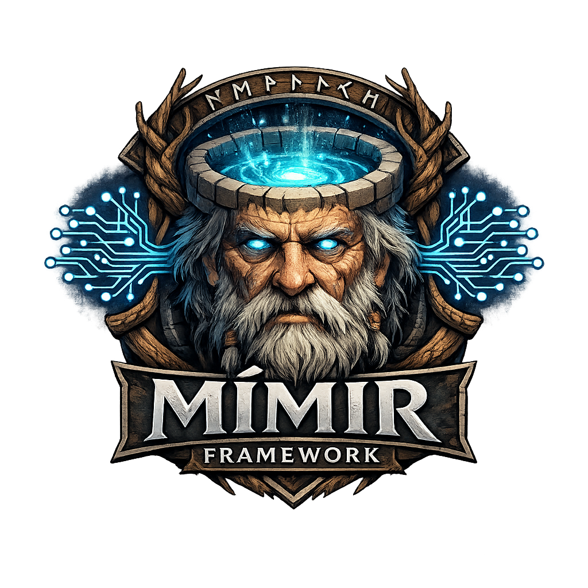

# Mímir Framework

Version framework : **2.4.0**  
Révision documentation : **2026-03-15**

Mímir est un framework de deep learning en **C++17** orienté **CPU-first** (SIMD/OpenMP) avec une API **Lua** pour prototyper rapidement, un registre d’architectures (Vision/NLP/Diffusion) et un système de **sérialisation** (SafeTensors + formats debug). Une accélération **Vulkan Compute** est disponible pour certains chemins.

## Objectifs

- Construire des modèles composables (layers → architectures → scripts).
- Entraîner et exécuter localement avec garde-fous mémoire.
- Sauvegarder/charger des checkpoints et échanger des poids (interop SafeTensors).

## Démarrage rapide

### Compiler

```bash
cmake -S . -B build
cmake --build build -j
```

### Lancer un script Lua

```bash
./bin/mimir --lua scripts/examples/vae_text_sample.lua -- --help
```

## Documentation

La documentation est dans le dossier `docs/`.

- Point d’entrée : `docs/00-INDEX.md`
- Installation & build : `docs/01-Getting-Started/`
- Guide utilisateur : `docs/02-User-Guide/`
- Référence API : `docs/03-API-Reference/`
- Internals : `docs/04-Architecture-Internals/`
- Performance & tuning : `docs/05-Advanced/`
- Contribution : `docs/06-Contributing/`

## Notes (limites)

- **CPU-first** : adapté au prototypage et à des modèles modestes ; pour des LLM très gros, il faut des optimisations spécifiques (batching, KV-cache, quantization).
- Tous les layers ne sont pas au même niveau de maturité : la doc distingue **stable** vs **expérimental**.

## Licence

Voir `LICENSE`.
