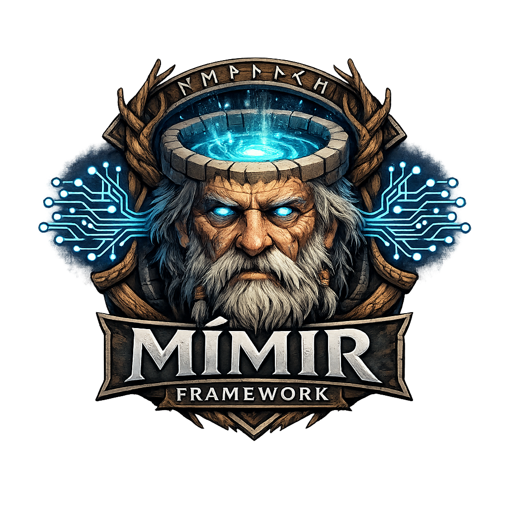

# Mímir Framework



<div align="center">

| Branche | unit-tests | publish-wiki |
| --- | --- | --- |
| `main` | [](https://github.com/brit45/mimir-framework/actions/workflows/unit-tests.yml) | [](https://github.com/brit45/mimir-framework/actions/workflows/wiki.yml) |
| `develop` | [](https://github.com/brit45/mimir-framework/actions/workflows/unit-tests.yml) | [](https://github.com/brit45/mimir-framework/actions/workflows/wiki.yml) |

</div>

Version framework : **3.1.0**
Révision documentation : **2026-07-01**

**Mímir est un moteur C++ de conception, d'entraînement et d'analyse d'architectures d'intelligence artificielle, pilotable par Lua ou JSON, intégrant son propre runtime, son gestionnaire mémoire, son système de datasets, ses outils de visualisation et de sérialisation, avec une approche CPU-first orientée recherche et expérimentation.**

---

## Vitrine (FR)

Mímir est un framework de recherche IA **CPU-first** où tu conçois les architectures en **C++**, puis tu pilotes entraînement/inférence via **Lua** ou **JSON (`--conf`)**.

Points clés:

- moteur de graphes IA autonome (runtime + mémoire + planner),
- registre central d'architectures (vision, NLP, diffusion),
- outillage intégré (datasets, viz SFML, sérialisation, benchmarks),
- approche orientée expérimentation et inspection interne des modèles.

---

## Showcase (EN)

Mímir is a **CPU-first C++ AI architecture engine**.
You define models in C++, then orchestrate training/inference with Lua scripts or JSON-driven runs.

Core strengths:

- autonomous graph runtime with integrated memory management,
- architecture registry (vision, NLP, diffusion),
- built-in tooling (datasets, visualization, serialization, benchmarking),
- research-focused workflow for fast experimentation and deep inspection.

---

## Version technique (FR)

### Positionnement

Mímir n'est pas un clone de PyTorch ou TensorFlow.

Le projet est pensé comme un **moteur de graphes IA autonome** :

- architecture des modèles en **C++**,
- orchestration en **Lua**,
- exécution reproductible via **JSON**,
- runtime et outillage intégrés dans un seul framework.

Philosophie:

```text
Architecture
	↓
C++
	↓
Registry
	↓
Runtime
	↓
Lua / JSON
	↓
Entraînement / Inférence / Analyse
```

---

### Architecture générale

```text
						Lua / JSON / CLI
										│
										▼
						API publique Mímir
										│
										▼
				Registry d'architectures
										│
										▼
						 Runtime IA
										│
				┌───────────┼───────────┐
				▼           ▼           ▼
			CPU         CUDA        ROCm
```

---

### Quick Start (5 minutes)

Guide complet : **[GET STARTED](./docs/01-Getting-Started/00-GET-STARTED.md)**

```bash
# 1) Dépendances minimales (Ubuntu/Debian)
sudo apt-get install -y cmake build-essential lua5.3 liblua5.3-dev libomp-dev

# 2) Compiler
cmake -S . -B build -DCMAKE_BUILD_TYPE=Release
cmake --build build -j

# 3) Vérifier le binaire
./bin/mimir --help

# 4) Smoke test
./bin/mimir --lua scripts/tests/test_serialization_smoke.lua

# 5) Premier modèle
./bin/mimir --lua scripts/templates/template_new_model.lua
```

---

### Modes d'utilisation

Mímir expose trois modes principaux:

1. **C++** : définition d'architectures, runtime et couches bas niveau.
2. **Lua** : pilotage des runs (train/inference/tools).
3. **JSON (`--conf`)** : exécution reproductible et scénarios paramétrés.

### CLI essentielle

```bash
./bin/mimir --lua <script.lua>
./bin/mimir --conf <config.json>
./bin/mimir --conf <config.json> --override path.to.key=value
```

En mode `--conf`, le runtime injecte automatiquement:

- `CONF` (table Lua contenant tout le JSON),
- `CONF_PATH` (chemin absolu de la config),
- `CONF_DIR` (répertoire de la config),
- `arg` (arguments de script, si définis dans `lua.scripts[i].args`).

Exemple de config minimale `--conf`:

```json
{
	"lua": {
		"scripts": [
			"scripts/templates/template_conf_load_and_train.lua"
		]
	},
	"model": {
		"architecture": "transformer",
		"vocab_size": 4096,
		"seq_len": 128,
		"d_model": 256,
		"num_layers": 4,
		"num_heads": 8,
		"mlp_hidden": 1024
	}
}
```

---

### Workflow modèle (v3.0+)

Cycle moderne recommandé:

1. `Mimir.Model.create(name, cfg)`
2. `Mimir.Model.allocate_params()`
3. `Mimir.Model.init_weights(...)` ou `Mimir.Serialization.load(...)`
4. `Mimir.Model.forward(...)`

`Model.build()` est conservé pour compatibilité legacy, mais **n'est plus requis** dans le flux moderne.

---

### Modèles disponibles

Le registre inclut notamment:

- MLP
- VAE, VAE Conv
- UNet
- Vision Transformer
- ResNet
- VGG16 / VGG19
- MobileNet
- GAN Latent
- Transformer
- Diffusion / Conditional Diffusion
- SDXL / PonyXL
- CLIP
- modèles HuggingFace
- modèles externes SafeTensors

---

### Runtime et performances

Capacités clés:

- OpenMP
- SIMD / AVX2 / FMA
- détection matérielle au démarrage
- dispatch CPU optimisé
- backends CUDA / ROCm (optionnels, en évolution)
- accélération Vulkan/OpenCL sur certains chemins

Le framework est **CPU-first** et optimisé pour les processeurs modernes.

---

### Gestion mémoire

Mímir intègre son propre système mémoire:

- `MemoryGuard`
- `DynamicTensorAllocator`
- spill disque
- compression
- lazy allocation
- éviction LRU

Objectifs:

- limiter les OOM,
- contrôler finement la RAM,
- exécuter des charges dépassant la RAM disponible via offload.

---

### Planner et exécution de graphe

Le planner de graphes prend en charge:

- fusion d'opérations,
- optimisation des durées de vie des tenseurs,
- planification d'allocation des buffers,
- réutilisation mémoire,
- préparation du runtime.

---

### Dataset, visualisation, sérialisation

### Dataset

Loader multimodal intégré (image/texte actuellement, audio/vidéo prévu), avec:

- association automatique des modalités,
- cache dataset,
- hash SHA256,
- lazy loading,
- gestion RAM.

### Visualisation

Interface SFML temps réel pour:

- loss et métriques,
- reconstructions et activations,
- heatmaps et latent,
- progression d'entraînement.

### Sérialisation

Formats:

- SafeTensors
- RawFolder
- DebugJson

Interop:

- checkpoints externes,
- compatibilité HuggingFace selon chemins supportés.

---

### Outils et tests

Outillage intégré:

- benchmarks,
- inspection d'architectures,
- analyse checkpoints / SafeTensors / DebugJson,
- profils mémoire/runtime,
- génération de rapports (HTML/PDF/Mermaid selon scripts).

Le repo inclut des tests unitaires, smoke tests, tests mémoire/runtime/Lua/registry/sérialisation.

---

### Build et dépendances

Prérequis principaux:

- CMake 3.15+
- compilateur C++17
- Lua 5.3+
- OpenMP

Build rapide:

```bash
cmake -S . -B build -DCMAKE_BUILD_TYPE=Release
cmake --build build -j
```

Installation détaillée (Linux/macOS/Windows, options CMake, troubleshooting):
**[docs/01-Getting-Started/02-Installation.md](./docs/01-Getting-Started/02-Installation.md)**

---

### Documentation

- **[GET STARTED](./docs/01-Getting-Started/00-GET-STARTED.md)**
- **[CLI](./docs/01-Getting-Started/03-CLI.md)**
- **[Config-driven scripting (`--conf`)](./docs/02-User-Guide/08-Config-Driven-Scripting.md)**
- **[Cycle de vie modèle](./docs/02-User-Guide/02-Model-Lifecycle.md)**
- **[API Reference](./docs/03-API-Reference/00-API-Overview.md)**
- **[Index complet](./docs/00-INDEX.md)**

---

### Structure du dépôt

- `src/` : coeur C++ (runtime, layers, registry, mémoire)
- `scripts/` : templates Lua, workflows, benchmarks, tests
- `configs/` : exemples de config JSON pour mode `--conf`
- `docs/` : documentation technique
- `bin/mimir` : exécutable CLI

---

## Technical Snapshot (EN)

Mímir is organized as a layered execution stack:

1. C++ model architecture definitions
2. Architecture registry
3. Graph runtime + planner
4. Lua/JSON orchestration layer

Recommended v3.0+ model lifecycle:

1. `Mimir.Model.create(name, cfg)`
2. `Mimir.Model.allocate_params()`
3. `Mimir.Model.init_weights(...)` or `Mimir.Serialization.load(...)`
4. `Mimir.Model.forward(...)`

`Model.build()` remains for backward compatibility but is not required in modern flows.

Main capabilities:

- CPU-first runtime (OpenMP, SIMD, AVX2, FMA)
- optional GPU backends (CUDA/ROCm/Vulkan/OpenCL paths)
- integrated memory stack (`MemoryGuard`, `DynamicTensorAllocator`, spill/compression/LRU)
- multimodal dataset pipeline and SFML real-time visualization
- checkpoint/weights interoperability (SafeTensors, RawFolder, DebugJson)

Primary docs entry points:

- [GET STARTED](./docs/01-Getting-Started/00-GET-STARTED.md)
- [CLI](./docs/01-Getting-Started/03-CLI.md)
- [Config-driven scripting (`--conf`)](./docs/02-User-Guide/08-Config-Driven-Scripting.md)
- [API Overview](./docs/03-API-Reference/00-API-Overview.md)

---

## Licence

Voir [LICENSE](./LICENSE).
