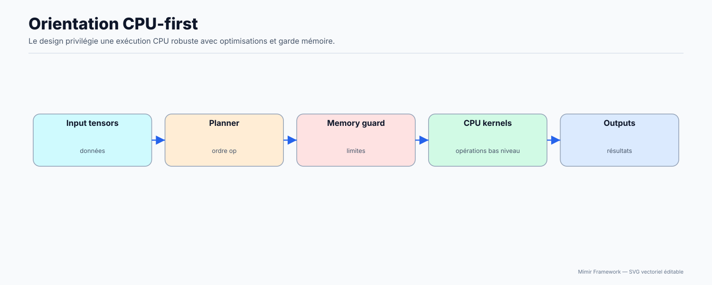
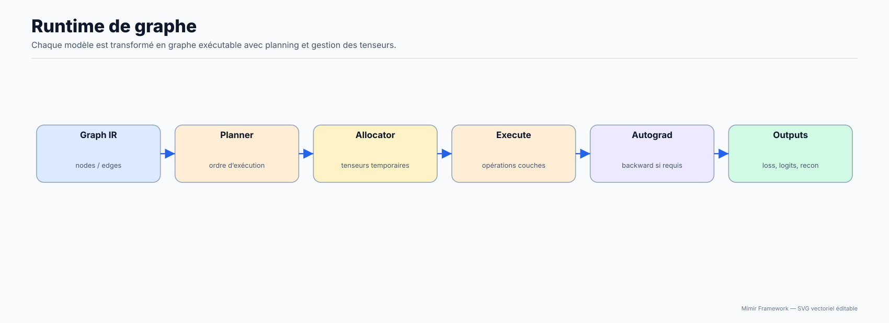
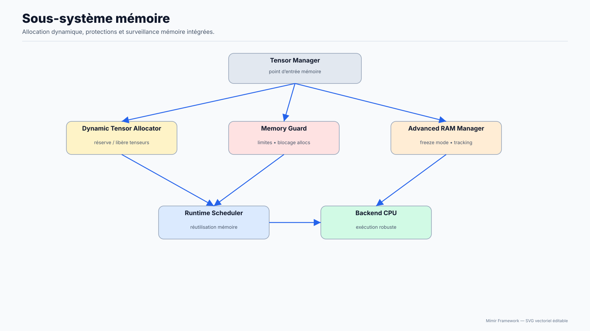

# Mímir AI Engine


## Framework Philosophy

**[Framework Philosophy](./docs/00-Framework-Philosophy.md)** — pourquoi C++, Lua, JSON, CPU-first, Registry, Planner, runtime independant et architectures compilees.

**[Scripting Contract](./docs/03-API-Reference/00-Scripting-Contract.md)** — specification officielle que tous les bridges doivent implementer.

| Branche | unit-tests | publish-wiki |
| --- | --- | --- |
| `main` | [](https://github.com/brit45/mimir-framework/actions/workflows/unit-tests.yml) | [](https://github.com/brit45/mimir-framework/actions/workflows/wiki.yml) |
| `develop` | [](https://github.com/brit45/mimir-framework/actions/workflows/unit-tests.yml) | [](https://github.com/brit45/mimir-framework/actions/workflows/wiki.yml) |

Version engine : **3.1.0**
Révision documentation : **2026-08-30**

Consultez d'abord l'[état réel du projet](./docs/00-PROJECT-STATUS.md) : cette
page distingue les chemins stables, partiels, expérimentaux, placeholders et
matériels testés dans le checkout courant.

**Mímir est un AI Engine C++ de conception, d'entraînement et d'analyse de systèmes IA, pilotable par Lua ou JSON, avec runtime, mémoire, dataset, visualisation et sérialisation intégrés, dans une approche CPU-first orientée recherche et expérimentation.**

---

## Vitrine (FR)

Mímir est un **AI Engine de recherche IA CPU-first** où tu conçois les architectures en **C++**, puis tu pilotes entraînement/inférence via **Lua** ou **JSON (`--conf`)**.

Points clés:

- AI engine de graphes autonome (runtime + mémoire + planner),
- registre central d'architectures (vision, NLP, diffusion),
- outillage intégré (datasets, viz SFML, sérialisation, benchmarks),
- approche orientée expérimentation et inspection interne des modèles.

---

## Showcase (EN)

Mímir is a **CPU-first C++ AI Engine**.
You define model architectures in C++, then orchestrate training/inference with Lua scripts or JSON-driven runs.

Core strengths:

- autonomous AI runtime and graph execution core,
- architecture registry (vision, NLP, diffusion),
- built-in tooling (datasets, visualization, serialization, benchmarking),
- research-focused workflow for fast experimentation and deep inspection.

---

## Version technique (FR)

### Positionnement

Mímir n'est pas un clone de PyTorch ou TensorFlow.

Le projet est pensé comme un **AI Engine autonome** :

- architecture des modèles en **C++**,
- orchestration en **Lua**,
- exécution reproductible via **JSON**,
- runtime et outillage intégrés dans un seul engine.

Philosophie:

```text
Architecture
  ↓
C++
  ↓
Registry
  ↓
Runtime
  ↓
Lua / JSON
  ↓
Entraînement / Inférence / Analyse
```

---

### Architecture générale

```text
            Lua / JSON / CLI
                    │
                    ▼
            API Engine Mímir
                    │
                    ▼
        Registry d'architectures
                    │
                    ▼
               Runtime IA
                    │
        ┌───────────┼───────────┐
        ▼           ▼           ▼
      CPU         CUDA        ROCm
```

Schéma visuel (SVG):




---

### Quick Start (5 minutes)

Guide complet : **[GET STARTED](./docs/01-Getting-Started/00-GET-STARTED.md)**

```bash
# 1) Dépendances minimales (Ubuntu/Debian)
sudo apt-get install -y cmake build-essential lua5.3 liblua5.3-dev libomp-dev

# 2) (Option recommande) bootstrap automatique Linux
./config.sh

# 3) Compiler
cmake -S . -B build -DCMAKE_BUILD_TYPE=Release
cmake --build build -j

# 4) Vérifier le binaire
./bin/mimir --help

# 5) Smoke test
./bin/mimir --lua scripts/tests/test_serialization_smoke.lua

# 6) Premier modèle
./bin/mimir --lua scripts/templates/template_new_model.lua
```

Notes rapides sur `config.sh`:

- Script Linux (Debian/Ubuntu) qui installe les dependances et configure CMake dans `build/`.
- Variables utiles: `BUILD_TYPE=Debug`, `ENABLE_VULKAN=0`, `ENABLE_OPENCL=0`, `ENABLE_SFML=0`, `ENABLE_LZ4=0`.
- Voir la doc detaillee: `docs/01-Getting-Started/02-Installation.md`.

Notes scripts Lua (cross-plateforme):

- Les scripts doivent utiliser `scripts/modules/fs.lua` pour les opérations fichiers/répertoires (`mkdir_p`, `join`, `dirname`, `list_dir`, `file_exists`).
- Éviter `os.execute("mkdir ...")`, `io.popen("ls ...")`, `test -d`, etc. dans les scripts métier.
- Les appels shell restent réservés aux besoins process externes (ex: ouvrir navigateur, lancer un outil), pas au filesystem applicatif.

### Docker (CPU/headless)

L'image Docker générique compile Mímir sans dépendre des instructions CPU de la
machine de build. Elle active Lua, OpenMP, LZ4 et FFmpeg, mais désactive SFML,
CUDA, ROCm, Vulkan, OpenCL et les bridges externes.

```bash
docker build --build-arg BUILD_JOBS=4 -t mimir:3.1.0 .
docker run --rm mimir:3.1.0 --version
docker run --rm mimir:3.1.0 \
  --lua scripts/templates/template_new_model.lua
```

Pour utiliser des données et conserver les checkpoints :

```bash
docker run --rm \
  -v "$PWD/datasets:/workspace/datasets:ro" \
  -v "$PWD/checkpoint:/workspace/checkpoint" \
  mimir:3.1.0 \
  --conf configs/vae_conv-training.json
```

La configuration JSON peut remplacer `OMP_NUM_THREADS` grâce à sa section
`env`. Les backends GPU nécessitent des images spécialisées avec leurs SDK et
un accès explicite au matériel; ce Dockerfile ne revendique pas ce support.

---

### Modes d'utilisation

Mímir expose trois modes principaux:

1. **C++** : définition d'architectures, noyau runtime et couches bas niveau.
2. **Lua** : pilotage des runs (train/inference/tools).
3. **JSON (`--conf`)** : exécution reproductible et scénarios paramétrés.

La [matrice de maturité](./docs/00-PROJECT-STATUS.md) indique pour chaque
sous-système s'il est actif, partiel, expérimental, placeholder ou en
construction. Elle doit être consultée avant toute revendication de support
GPU, FPGA, modèle externe ou bridge de langage.

Schéma des flux d'exécution (SVG):


### CLI essentielle

```bash
./bin/mimir --lua <script.lua>
./bin/mimir --conf <config.json>
./bin/mimir --conf <config.json> --run <task>
./bin/mimir --conf <config.json> --override path.to.key=value
```

#### Mode `--conf`

Charge un fichier JSON et exécute la section `lua.scripts` séquentiellement.

Le runtime injecte automatiquement dans chaque script Lua :

| Variable Lua | Contenu |
|---|---|
| `CONF` | Table Lua contenant l'intégralité du JSON (après overrides) |
| `CONF_PATH` | Chemin absolu du fichier de conf |
| `CONF_DIR` | Répertoire du fichier de conf |
| `arg` | Arguments de script (`lua.scripts[i].args`) |

#### Mode `--run <task>` (avec `--conf`)

Sélectionne une tâche nommée définie dans la section `tasks` du fichier de conf.
Sans `--run`, la section `lua` racine est utilisée (comportement par défaut).

```bash
# Tâche par défaut (section lua racine)
./bin/mimir --conf config.json

# Tâche nommée
./bin/mimir --conf config.json --run train
./bin/mimir --conf config.json --run infer

# Tâche + override à la volée
./bin/mimir --conf config.json --run train --override training.learning_rate=5e-6
```

Si la tâche est introuvable, mimir liste les tâches disponibles avec leur description.

#### Exemple de config `--conf` avec tâches

```json
{
  "lua": {
    "scripts": ["scripts/training/train_vae_conv.lua"]
  },
  "tasks": {
    "train": {
      "description": "Entraînement complet",
      "lua": { "scripts": ["scripts/training/train_vae_conv.lua"] }
    },
    "infer": {
      "description": "Génération d'images",
      "lua": {
        "scripts": [{
          "script": "scripts/inferences/infer_vae_conv.lua",
          "args": ["--num-samples", "16"]
        }]
      }
    }
  },
  "model": {
    "architecture": "vae_conv",
    "image_w": 512, "image_h": 512, "image_c": 3,
    "latent_h": 64, "latent_w": 64, "latent_c": 128,
    "base_channels": 8
  },
  "training": {
    "num_epochs": 35,
    "learning_rate": 1e-5,
    "optimizer": "adamw"
  },
  "visualization": { "enabled": true }
}
```

#### JSON Schema (`--conf`)

Le fichier `configs/conf.schema.json` documente toutes les sections acceptées :

| Section | Rôle |
|---|---|
| `lua` | Scripts Lua par défaut (sans `--run`) |
| `tasks` | Tâches nommées sélectionnables via `--run` |
| `model` | Config architecture — `architecture` détermine les champs valides |
| `training` | Hyperparamètres d'entraînement |
| `dataset` | Chemins et paramètres du dataset |
| `inference` | Paramètres de génération |
| `visualization` | Fenêtre SFML (lue par le runtime C++) |
| `logging` | Affichage console (`show_htop_display`, etc.) |
| `env` | Variables appliquées au processus avant le run; elles remplacent les valeurs héritées du shell |

---

### Workflow modèle (v3.0+)

Cycle moderne recommandé:

1. `Mimir.Model.create(name, cfg)`
2. `Mimir.Model.allocate_params()`
3. `Mimir.Model.init_weights(...)` ou `Mimir.Serialization.load(...)`
4. `Mimir.Model.forward(...)`

`Model.build()` est conservé pour compatibilité legacy, mais **n'est plus requis** dans le flux moderne.

---

### Modèles disponibles

Le registre inclut notamment:

- MLP
- VAE, VAE Conv
- UNet
- Vision Transformer
- ResNet
- VGG16 / VGG19
- MobileNet
- GAN Latent
- Transformer
- Diffusion / Conditional Diffusion
- SDXL
- CLIP
- modèles HuggingFace
- modèles externes SafeTensors

---

### Runtime engine et performances

Capacités clés:

- OpenMP
- SIMD / AVX2 / FMA
- détection matérielle au démarrage
- dispatch CPU optimisé
- backends CUDA / ROCm (optionnels, en évolution)
- accélération Vulkan/OpenCL sur certains chemins

L'engine est **CPU-first** et optimisé pour les processeurs modernes.

---

### Gestion mémoire de l'engine

Mímir intègre son propre système mémoire engine:

- `MemoryGuard`
- `DynamicTensorAllocator`
- spill disque
- compression
- lazy allocation
- éviction LRU

Objectifs:

- limiter les OOM,
- contrôler finement la RAM,
- exécuter des charges dépassant la RAM disponible via offload.

---

### Planner et exécution de graphe engine

Le planner de graphes prend en charge:

- fusion d'opérations,
- optimisation des durées de vie des tenseurs,
- planification d'allocation des buffers,
- réutilisation mémoire,
- préparation du runtime.

Schémas internes (SVG):





---

### Dataset, visualisation, sérialisation

### Dataset

Loader multimodal intégré (image/texte actuellement, audio/vidéo prévu), avec:

- association automatique des modalités,
- cache dataset,
- hash SHA256,
- lazy loading,
- gestion RAM.

### Visualisation

Interface SFML temps réel pour:

- loss et métriques,
- reconstructions et activations,
- heatmaps et latent,
- progression d'entraînement.

Nouveautés UI (v3.1.x):

- rendu `Blocks / Layers` en mode `HEATMAP` ou `REEL` (`M`),
- palettes heatmap cyclables au clavier (`K`) : `CLASSIC`, `TURBO`, `INFERNO`, `VIRIDIS`,
- mise à jour immédiate de la palette (sans attendre la step suivante),
- filtrage des tenseurs de packing final (`out_concat` / `out_pack`) pour éviter les faux aperçus,
- ordre visuel forcé dans `Outputs`: `recon` affiché juste avant `diff/resdiff` quand les deux existent,
- barre de progression globale (epochs) + barre dédiée batch courant (sous la globale),
- couleur de la barre batch pilotée par `batch_time_ms` (rapide=vert, plus lent=orange/rouge).

### Sérialisation

Formats:

- SafeTensors
- RawFolder
- DebugJson

Interop:

- checkpoints externes,
- compatibilité HuggingFace selon chemins supportés.

---

### Outils et tests

Outillage intégré:

- benchmarks,
- inspection d'architectures,
- analyse checkpoints / SafeTensors / DebugJson,
- profils mémoire/runtime,
- génération de rapports (HTML/PDF/Mermaid selon scripts).

Le repo inclut des tests unitaires, smoke tests, tests mémoire/runtime/Lua/registry/sérialisation.

---

### Build et dépendances

Prérequis principaux:

- CMake 3.15+
- compilateur C++17
- Lua 5.3+
- OpenMP

Build rapide:

```bash
# Bootstrap automatique (installe les dependances puis configure CMake)
./config.sh

# Compilation
cmake -S . -B build -DCMAKE_BUILD_TYPE=Release
cmake --build build -j
```

Exemple avec options:

```bash
WORKROOT=/home/user/tensor-2 ENABLE_VULKAN=1 ENABLE_OPENCL=1 ./config.sh
```

Installation détaillée (Linux/macOS/Windows, options CMake, troubleshooting):
**[docs/01-Getting-Started/02-Installation.md](./docs/01-Getting-Started/02-Installation.md)**

---

### Documentation

- **[GET STARTED](./docs/01-Getting-Started/00-GET-STARTED.md)**
- **[CLI](./docs/01-Getting-Started/03-CLI.md)**
- **[Config-driven scripting (`--conf`)](./docs/02-User-Guide/08-Config-Driven-Scripting.md)**
- **[Cycle de vie modèle](./docs/02-User-Guide/02-Model-Lifecycle.md)**
- **[Packages d’architecture MPK](./docs/02-User-Guide/15-MPK.md)**
- **[API Reference](./docs/03-API-Reference/00-API-Overview.md)**
- **[Index complet](./docs/00-INDEX.md)**

---

### Structure du dépôt

- `src/` : coeur C++ (runtime, layers, registry, mémoire)
- `scripts/` : templates Lua, workflows, benchmarks, tests
- `configs/` : exemples de config JSON pour mode `--conf`
- `docs/` : documentation technique
- `bin/mimir` : exécutable CLI

---

## Technical Snapshot (EN)

Mímir is organized as a layered execution stack:

1. C++ model architecture definitions
2. Architecture registry
3. Graph runtime + planner
4. Lua/JSON orchestration layer

Recommended v3.0+ model lifecycle:

1. `Mimir.Model.create(name, cfg)`
2. `Mimir.Model.allocate_params()`
3. `Mimir.Model.init_weights(...)` or `Mimir.Serialization.load(...)`
4. `Mimir.Model.forward(...)`

`Model.build()` remains for backward compatibility but is not required in modern flows.

Main capabilities:

- CPU-first runtime (OpenMP, SIMD, AVX2, FMA)
- optional GPU backends (CUDA/ROCm/Vulkan/OpenCL paths)
- integrated memory stack (`MemoryGuard`, `DynamicTensorAllocator`, spill/compression/LRU)
- multimodal dataset pipeline and SFML real-time visualization
- checkpoint/weights interoperability (SafeTensors, RawFolder, DebugJson)

Primary docs entry points:

- [GET STARTED](./docs/01-Getting-Started/00-GET-STARTED.md)
- [CLI](./docs/01-Getting-Started/03-CLI.md)
- [Config-driven scripting (`--conf`)](./docs/02-User-Guide/08-Config-Driven-Scripting.md)
- [API Overview](./docs/03-API-Reference/00-API-Overview.md)

---

## Licence

Voir [LICENSE](./LICENSE).
