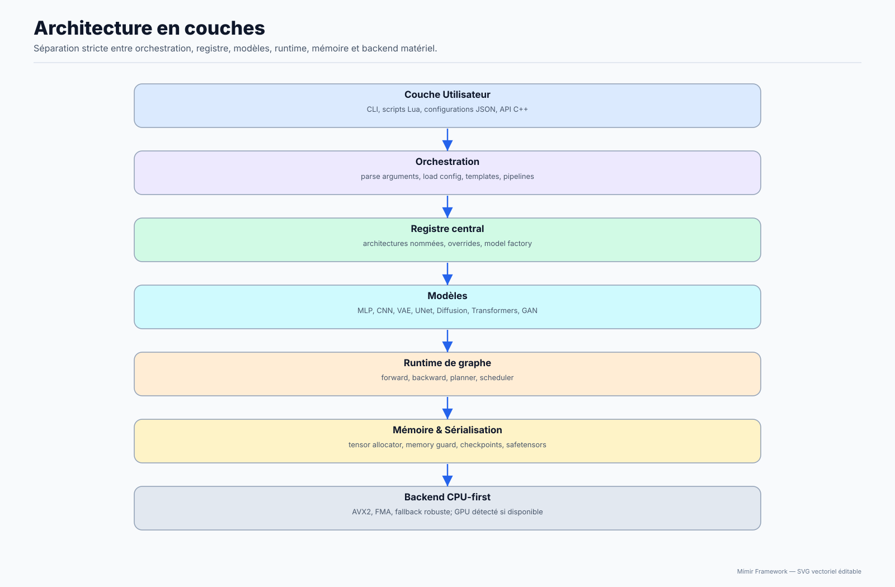
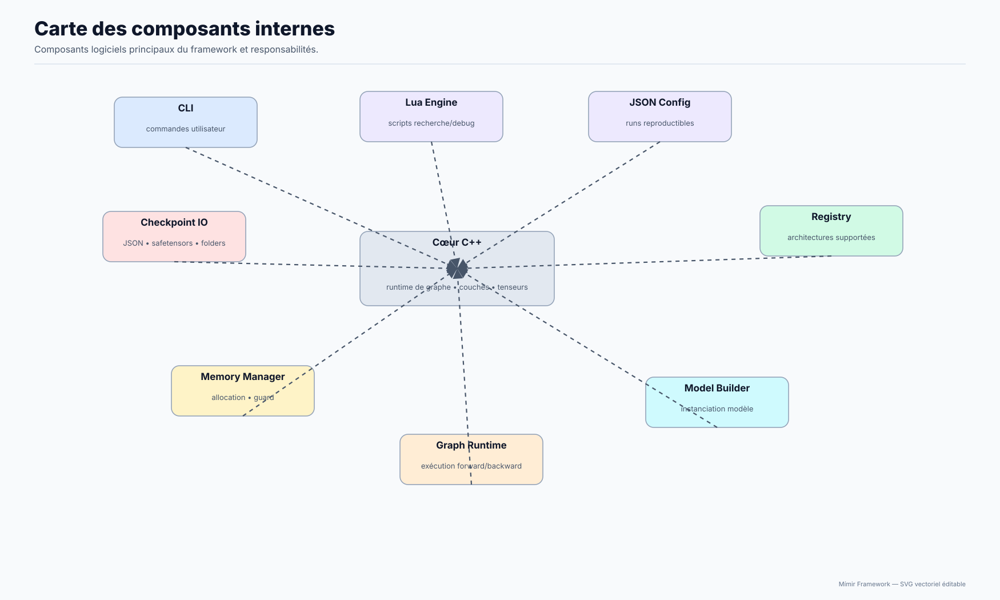

# Philosophie du framework

Expliquer pourquoi Mímir prend ces choix techniques, sans entrer dans les détails d'implémentation.

**Public concerné :** Toute personne qui veut comprendre l'ADN du projet en 30 secondes.

> **Prérequis**
>
> Rien. Cette page est volontairement très courte.

## Diagrammes d'explication

## Pourquoi ces choix ?

- Pourquoi C++ ? Pour garder le contrôle bas niveau, les performances et la portabilité du coeur.
- Pourquoi Lua ? Pour un scripting simple, lisible et stable autour du moteur.
- Pourquoi JSON ? Pour des workflows reproductibles, inspectables et faciles à automatiser.
- Pourquoi CPU-first ? Pour rester previsible, portable et facile a debuguer avant toute acceleration.
- Pourquoi un Registry ? Pour centraliser les architectures et rendre les modeles decouvrables.
- Pourquoi un Planner ? Pour separer l'intention metier de l'execution effective.
- Pourquoi un Runtime independant ? Pour pouvoir changer la couche d'execution sans casser le modele.
- Pourquoi les architectures sont compilees ? Pour lier les graphs au code, eviter les surprises au runtime et garder des builds deterministes.

## Étapes suivantes

- Consultez l'[index de la documentation](00-INDEX.md).
- Découvrez les [concepts essentiels](02-User-Guide/01-Core-Concepts.md).
- Étudiez la [vue d'ensemble du moteur](04-Architecture-Internals/01-Engine-Overview.md).
