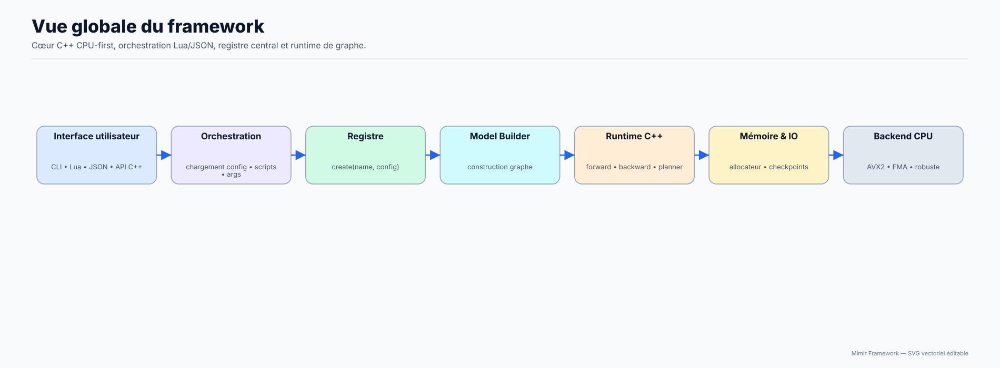
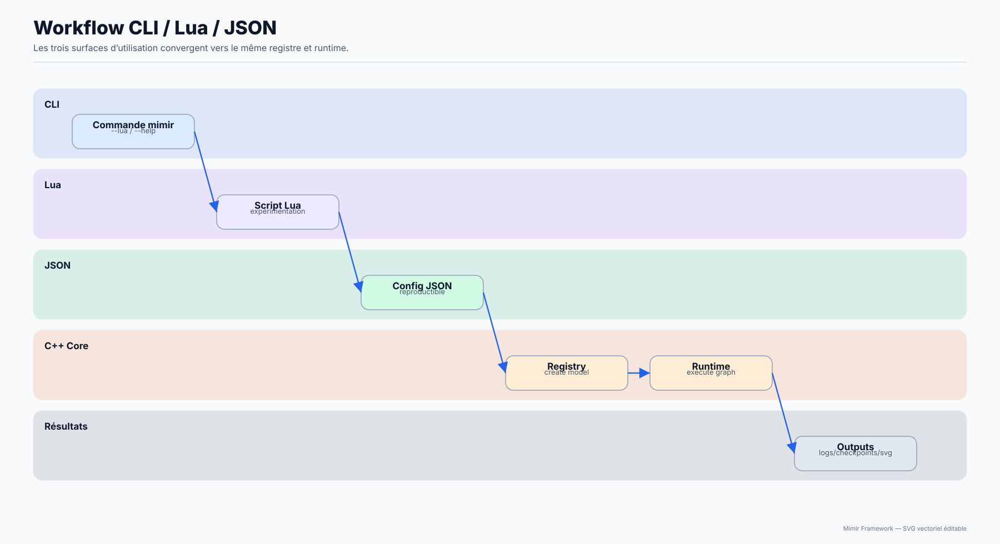
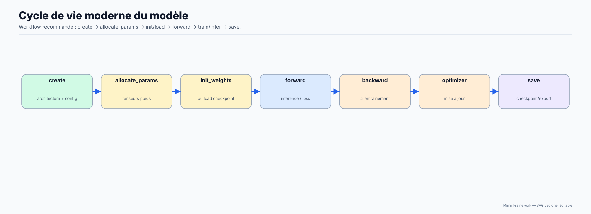
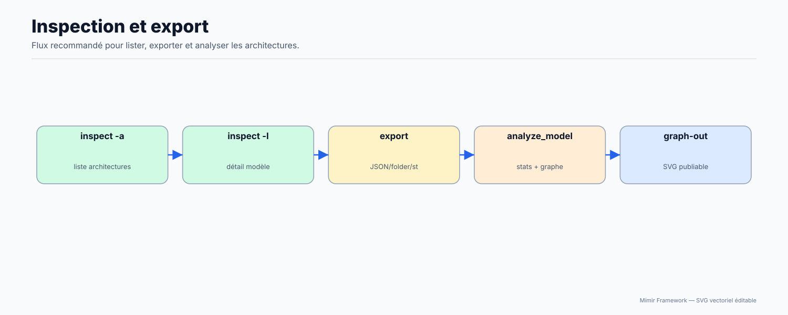

# Documentation Mímir (réécrite)

Version framework : **3.1.0**  
Révision documentation : **2026-07-01**

Cette documentation remplace l’ancienne doc (archivée dans [docs_archive/2026-02-14/](docs_archive/2026-02-14/)).

Guide de style documentation : [docs/00-STYLE.md](00-STYLE.md)

Philosophie du projet : [docs/00-Framework-Philosophy.md](00-Framework-Philosophy.md)

---

## Schémas SVG recommandés

Pour accélérer la compréhension, voici les schémas les plus utiles:









---

## 🚀 NOUVEAU — Démarrage rapide (5-10 min)

**👉 Si tu débutes, commence ICI :**

→ **[🚀 GET STARTED](01-Getting-Started/00-GET-STARTED.md)** — Démarrage rapide en 5 étapes

- Vérifier les prérequis
- Compiler le framework
- Exécuter un test rapide
- Créer ton premier modèle
- Sauvegarder un checkpoint

Puis lis dans cet ordre :

1. [Compilation & dépendances détaillées](01-Getting-Started/02-Installation.md) (si problèmes de build)
2. [Cycle de vie d'un modèle](02-User-Guide/02-Model-Lifecycle.md) (comprendre create/allocate/init/forward)
3. [API Lua de base](03-API-Reference/19-Globals.md) (ce que le runtime injecte)
4. [Contrat de scripting officiel](03-API-Reference/00-Scripting-Contract.md) (spec commune des bridges)
5. [Parcours tutoriel complet](08-Tuto/06-Parcours-Complet-Framework.md) (vue guidée de tout le framework)

---

## 📚 Documentation complète par section

## Index par tâche (guide rapide)

- Vérifier que l’environnement marche
  - Lis : [docs/01-Getting-Started/01-Quick-Start.md](01-Getting-Started/01-Quick-Start.md)
  - Lance :

```bash
./bin/mimir --lua scripts/templates/template_new_model.lua
```

- Bootstrap Linux rapide (deps + CMake)
  - Lis : [docs/01-Getting-Started/02-Installation.md](01-Getting-Started/02-Installation.md)
  - Lance :

```bash
./config.sh
cmake --build build -j"$(nproc)"
```

- Comprendre create/build/alloc/init
  - Lis : [docs/02-User-Guide/02-Model-Lifecycle.md](02-User-Guide/02-Model-Lifecycle.md)
  - Lance :

```bash
./bin/mimir --lua scripts/templates/template_new_model.lua
```

- Démarrer rapidement avec la Pipeline API (v3.0+)
  - Lis : [docs/02-User-Guide/06-Lua-Scripting.md](02-User-Guide/06-Lua-Scripting.md)
  - Lance :

```bash
./bin/mimir --lua scripts/templates/template_pipeline_only.lua
./bin/mimir --lua scripts/templates/template_pipeline_args.lua -- --no-train
```

- Apprendre à passer des arguments
  - Lis : [docs/02-User-Guide/06-Lua-Scripting.md](02-User-Guide/06-Lua-Scripting.md)
  - Lance :

```bash
./bin/mimir --lua scripts/training/ponyxl_ddpm_train.lua -- --help
```

- Éviter les OOM et stabiliser les runs
  - Lis : [docs/02-User-Guide/09-Memory.md](02-User-Guide/09-Memory.md)
  - Lance :

```bash
./bin/mimir --lua scripts/benchmarks/benchmark_official.lua -- --safe --iters 1
```

- Sauver/charger proprement
  - Lis : [docs/03-API-Reference/02-Serialization.md](03-API-Reference/02-Serialization.md)
  - Lance :

```bash
./bin/mimir --lua scripts/tests/test_serialization_smoke.lua
```

## Cheat sheet (conventions + champs importants)

### Conventions d’IO (noms de tenseurs)

| Nom | Type typique | Sens |
| --- | ---: | --- |
| `__input__` | float *ou* ids int (selon archi) | entrée par défaut |
| `text_ids` | ids int | entrée texte dédiée (NLP) |
| `x` | float | sortie principale (convention) |

### Champs de config Transformer (v3.0+)

| Champ | Sens |
| --- | --- |
| `seq_len` | longueur de séquence traitée |
| `vocab_size` | taille du vocab |
| `d_model` | dimension embedding/model |
| `mlp_hidden` | hidden du MLP (FFN) |
| `num_layers` | nombre de blocs |
| `num_heads` | nombre de têtes |

### Legacy → moderne (scripts)

| Ancien | Nouveau | Pourquoi |
| --- | --- | --- |
| `max_seq_len` | `seq_len` | nom canonique registre |
| `d_ff` | `mlp_hidden` | explicite (FFN/MLP) |
| `embed_dim` | `d_model` | cohérent Transformer |

## 1) Démarrer (10 minutes)

- Quick start : [docs/01-Getting-Started/01-Quick-Start.md](01-Getting-Started/01-Quick-Start.md)
- Installer / compiler : [docs/01-Getting-Started/02-Installation.md](01-Getting-Started/02-Installation.md)
- CLI (binaire `mimir`) : [docs/01-Getting-Started/03-CLI.md](01-Getting-Started/03-CLI.md)
- Organisation du repo : [docs/01-Getting-Started/04-Repo-Layout.md](01-Getting-Started/04-Repo-Layout.md)
- Smoketest (valider l’environnement rapidement) : [docs/01-Getting-Started/05-Smoketest.md](01-Getting-Started/05-Smoketest.md)

Parcours conseillé si tu reviens sur le projet après plusieurs semaines :

1. valide le binaire avec le smoketest,
2. relis le lifecycle modèle,
3. seulement ensuite ouvre la référence API détaillée.

## 2) Utiliser le framework

- Concepts essentiels : [docs/02-User-Guide/01-Core-Concepts.md](02-User-Guide/01-Core-Concepts.md)
- Workflow modèle (create/build/allocate/forward/backward) : [docs/02-User-Guide/02-Model-Lifecycle.md](02-User-Guide/02-Model-Lifecycle.md)
- Données & datasets : [docs/02-User-Guide/03-Data.md](02-User-Guide/03-Data.md)
- Entraînement : [docs/02-User-Guide/04-Training.md](02-User-Guide/04-Training.md)
- Inférence : [docs/02-User-Guide/05-Inference.md](02-User-Guide/05-Inference.md)
- Scripting Lua (args, globals) : [docs/02-User-Guide/06-Lua-Scripting.md](02-User-Guide/06-Lua-Scripting.md)
- Tokenizer & ConditioningEncoder : [docs/02-User-Guide/07-Tokenizer-Encoder.md](02-User-Guide/07-Tokenizer-Encoder.md)
- Checkpoints / reprise : [docs/02-User-Guide/08-Checkpoints.md](02-User-Guide/08-Checkpoints.md)
- Analyse d’un artefact modèle sur disque (SafeTensors / RawFolder / DebugJson) : [docs/02-User-Guide/08-Checkpoints.md](02-User-Guide/08-Checkpoints.md)
- Mémoire (Allocator, MemoryGuard) : [docs/02-User-Guide/09-Memory.md](02-User-Guide/09-Memory.md)
- Scripts d’exemples : [docs/02-User-Guide/10-Examples.md](02-User-Guide/10-Examples.md)
- **Config-driven scripting** (`--conf` mode, workflows, automation) : [docs/02-User-Guide/08-Config-Driven-Scripting.md](02-User-Guide/08-Config-Driven-Scripting.md)
- Scripts d'exemples : [docs/02-User-Guide/10-Examples.md](02-User-Guide/10-Examples.md)
- Tutoriel VAEText : [docs/02-User-Guide/11-VAEText.md](02-User-Guide/11-VAEText.md)
- Tutoriel Transformer/GPT : [docs/02-User-Guide/12-Transformer-GPT.md](02-User-Guide/12-Transformer-GPT.md)
- Tutoriel diffusion (PonyXL/SD3.5) : [docs/02-User-Guide/13-Diffusion.md](02-User-Guide/13-Diffusion.md)

## 3) Référence API

- Vue d’ensemble API Lua : [docs/03-API-Reference/00-API-Overview.md](03-API-Reference/00-API-Overview.md)
- Layers (statut, paramètres, compat) : [docs/03-API-Reference/01-Layers.md](03-API-Reference/01-Layers.md)
- Sérialisation (save/load, formats, checksums) : [docs/03-API-Reference/02-Serialization.md](03-API-Reference/02-Serialization.md)
- `Mimir.Model` : [docs/03-API-Reference/10-Model.md](03-API-Reference/10-Model.md)
- `Mimir.Architectures` : [docs/03-API-Reference/11-Architectures.md](03-API-Reference/11-Architectures.md)
- `Mimir.Tokenizer` : [docs/03-API-Reference/12-Tokenizer.md](03-API-Reference/12-Tokenizer.md)
- `Mimir.Dataset` : [docs/03-API-Reference/13-Dataset.md](03-API-Reference/13-Dataset.md)
- Mémoire / allocator : [docs/03-API-Reference/14-Memory.md](03-API-Reference/14-Memory.md)
- Visualisation & monitoring : [docs/03-API-Reference/15-Viz-Htop.md](03-API-Reference/15-Viz-Htop.md)
- Sérialisation (détaillé) : [docs/03-API-Reference/16-Serialization.md](03-API-Reference/16-Serialization.md)
- `Mimir.NeuroPulse` : [docs/03-API-Reference/17-NeuroPulse.md](03-API-Reference/17-NeuroPulse.md)
- `Mimir.Layers` (ops) : [docs/03-API-Reference/18-Layers-Module.md](03-API-Reference/18-Layers-Module.md)
- `Mimir.IO` (I/O images) : [docs/03-API-Reference/21-IO.md](03-API-Reference/21-IO.md)
- Variables d'environnement (`MIMIR_*`) : [docs/03-API-Reference/22-Environment-Variables.md](03-API-Reference/22-Environment-Variables.md)
- Globals & aliases : [docs/03-API-Reference/19-Globals.md](03-API-Reference/19-Globals.md)
- Mapping Lua ↔ C++ (sommaire) : [docs/03-API-Reference/20-Lua-API-Cpp-Mapping.md](03-API-Reference/20-Lua-API-Cpp-Mapping.md)

## 🆕 Nouveautés de la série 3.0 (résumé)

| Quoi | Où |
| --- | --- |
| Nouveau module `Mimir.IO` (lecture image RGB u8) | [03-API-Reference/21-IO.md](03-API-Reference/21-IO.md) |
| `Mimir.Model.create_from_config(full_cfg)` | [03-API-Reference/10-Model.md](03-API-Reference/10-Model.md) |
| `Mimir.Model.dtype()` / dtype setter | [03-API-Reference/10-Model.md](03-API-Reference/10-Model.md) |
| Alias `Mimir.model` (lowercase) | [03-API-Reference/19-Globals.md](03-API-Reference/19-Globals.md) |
| Helpers PonyXL-DDPM (train/val/viz/text2img/vae_scale) | [03-API-Reference/20-Lua-API-Cpp-Mapping.md](03-API-Reference/20-Lua-API-Cpp-Mapping.md) |
| Nouveaux templates : `template_pipeline_only.lua` + `template_pipeline_args.lua` | [scripts/README.md](../scripts/README.md) |
| pipeline_api.lua : dtype robuste (Mimir.model / Mimir.Model) | [scripts/README.md](../scripts/README.md) |
| Détection hardware au démarrage (AVX2/FMA/F16C/BMI2 + CUDA/ROCm) | `bin/mimir --help` |

Pour éviter les confusions avec l’ancienne doc : certains paragraphes parlent encore de fonctionnalités “nouvelles en v3.0”. Lis cela comme “introduit dans la branche 3.x, toujours valable sur la version courante”, et non comme une indication que la version courante serait restée sur la première release de cette branche.

## 4) Internals (comment ça marche)

- Index internals (étendu) : [docs/04-Architecture-Internals/00-Internals-Index.md](04-Architecture-Internals/00-Internals-Index.md)
- Moteur d’exécution : [docs/04-Architecture-Internals/01-Engine-Overview.md](04-Architecture-Internals/01-Engine-Overview.md)
- Mémoire & allocateur : [docs/04-Architecture-Internals/02-Memory.md](04-Architecture-Internals/02-Memory.md)
- Backends hardware (CPU/Vulkan/OpenCL) : [docs/04-Architecture-Internals/03-Hardware-Backends.md](04-Architecture-Internals/03-Hardware-Backends.md)
- Monitoring (Htop/SFML/threads) : [docs/04-Architecture-Internals/04-Monitoring-Htop-Visualizer.md](04-Architecture-Internals/04-Monitoring-Htop-Visualizer.md)
- AdvancedRAMManager (cache/compression/spill) : [docs/04-Architecture-Internals/05-AdvancedRAMManager.md](04-Architecture-Internals/05-AdvancedRAMManager.md)
- Classe `Model` (C++) : [docs/04-Architecture-Internals/10-Model-Class.md](04-Architecture-Internals/10-Model-Class.md)
- Helpers C++ (`Helpers.hpp`) : [docs/04-Architecture-Internals/11-Helpers.md](04-Architecture-Internals/11-Helpers.md)
- Stockage `tensor` + alloc dynamique : [docs/04-Architecture-Internals/12-Tensor-Storage.md](04-Architecture-Internals/12-Tensor-Storage.md)
- Autograd / gradients / backward : [docs/04-Architecture-Internals/13-Autograd-Gradients.md](04-Architecture-Internals/13-Autograd-Gradients.md)
- Layers / `LayerOps` / layouts : [docs/04-Architecture-Internals/14-Layers-And-Ops.md](04-Architecture-Internals/14-Layers-And-Ops.md)
- Sérialisation (implémentation) : [docs/04-Architecture-Internals/15-Serialization-Internals.md](04-Architecture-Internals/15-Serialization-Internals.md)
- Tokenizer / ConditioningEncoder (implémentation) : [docs/04-Architecture-Internals/16-Tokenizer-Encoder-Internals.md](04-Architecture-Internals/16-Tokenizer-Encoder-Internals.md)
- Bindings Lua (implémentation) : [docs/04-Architecture-Internals/17-Lua-Bindings-Internals.md](04-Architecture-Internals/17-Lua-Bindings-Internals.md)
- RuntimeAllocator / scratchpads : [docs/04-Architecture-Internals/18-RuntimeAllocator-And-Scratchpads.md](04-Architecture-Internals/18-RuntimeAllocator-And-Scratchpads.md)
- Registre modèles / builders : [docs/04-Architecture-Internals/19-Models-Registry-And-Builders.md](04-Architecture-Internals/19-Models-Registry-And-Builders.md)
- CLI / entry points : [docs/04-Architecture-Internals/20-CLI-EntryPoints.md](04-Architecture-Internals/20-CLI-EntryPoints.md)

## 5) Performance

- Performance & tuning CPU : [docs/05-Advanced/01-Performance.md](05-Advanced/01-Performance.md)
- Debug & stabilité numérique : [docs/05-Advanced/02-Debugging.md](05-Advanced/02-Debugging.md)
- Analyse modèle (outil `analyze_model.lua`, graphe Mermaid Markdown) : [docs/05-Advanced/02-Debugging.md](05-Advanced/02-Debugging.md)
- LLM (état / manque / roadmap) : [docs/05-Advanced/03-LLM-Readiness.md](05-Advanced/03-LLM-Readiness.md)
- Carte du code source (C/C++, fichier par fichier) : [docs/05-Advanced/04-Source-Code-Map.md](05-Advanced/04-Source-Code-Map.md)

## 6) Contribution

- Contribuer : [docs/06-Contributing/01-Contributing.md](06-Contributing/01-Contributing.md)
- Ajouter une architecture + registre + script Lua + outils : [docs/06-Contributing/02-New-Architecture-And-Tools.md](06-Contributing/02-New-Architecture-And-Tools.md)
- Chapitre développeur complet (models, runtimes, features, scripting multi-langage) : [docs/06-Contributing/03-Extending-Models-Runtimes-And-Features.md](06-Contributing/03-Extending-Models-Runtimes-And-Features.md)
- Tutoriel pas-à-pas: ajouter une entrée Python (transposable Ruby/JS/Perl/Java/Rust) : [docs/06-Contributing/04-Tutorial-Add-Python-Scripting-Entry.md](06-Contributing/04-Tutorial-Add-Python-Scripting-Entry.md)

## 7) Devs (guide d'implémentation)

- Index développeur : [docs/07-Devs/00-INDEX.md](07-Devs/00-INDEX.md)
- Fonctionnement du framework : [docs/07-Devs/01-How-The-Framework-Works.md](07-Devs/01-How-The-Framework-Works.md)
- Construire un modèle (model.push + wiring C/C++) : [docs/07-Devs/02-Building-Models-And-Layers.md](07-Devs/02-Building-Models-And-Layers.md)
- Config + registre d'architectures : [docs/07-Devs/03-Config-And-Registry.md](07-Devs/03-Config-And-Registry.md)
- Modifier / ajouter un runtime : [docs/07-Devs/04-Runtime-Development.md](07-Devs/04-Runtime-Development.md)
- Contrat API scripting inter-langages : [docs/07-Devs/05-Scripting-System-Contract.md](07-Devs/05-Scripting-System-Contract.md)

## 8) Tuto

- Index tuto : [docs/08-Tuto/00-INDEX.md](08-Tuto/00-INDEX.md)
- Cours framework en 3 etapes (debutant -> etudiant -> avance) : [docs/08-Tuto/01-Cours-Framework-3-Etapes.md](08-Tuto/01-Cours-Framework-3-Etapes.md)

## Convention de noms

- `__input__` : entrée float par défaut (ou ids int selon l’archi)
- `text_ids` : entrée ids int pour les architectures NLP qui consomment un Embedding
- `x` : sortie float principale du modèle (convention dans les architectures)

## Où est la “vérité” ?

- Contrat API scripting (globals/aliases partagés) : [src/scriptings/ScriptingContext.hpp](../src/scriptings/ScriptingContext.hpp)
- API Lua exportée (implémentation) : [src/scriptings/Lua/luaScripting/LuaScripting.cpp](../src/scriptings/Lua/luaScripting/LuaScripting.cpp)
- Moteur et exécution des layers : [src/Model.cpp](../src/Model.cpp)
- Registre des architectures : [src/Models/Registry/ModelArchitectures.cpp](../src/Models/Registry/ModelArchitectures.cpp)
- Tokenizer/ConditioningEncoder : [src/Tokenizer.cpp](../src/Tokenizer.cpp), [src/Encoder.cpp](../src/Encoder.cpp)
