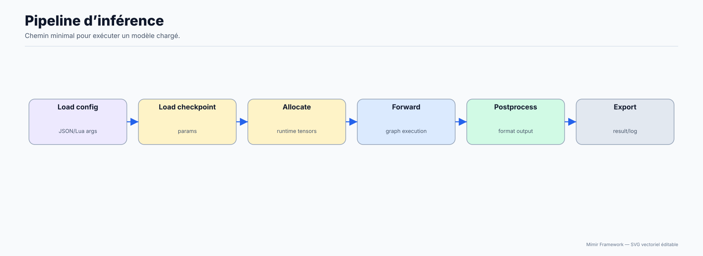

# Inférence

Exécuter une inférence propre depuis un modèle créé ou chargé.

**Public concerné :** Débutant à intermédiaire.

> **Prérequis**
>
> Avoir un checkpoint ou une config d'architecture.

## Diagramme d'explication



Cette page se concentre sur l’inférence **via l’API Lua**.

Voir aussi:

- API brute `Mimir.Model`: `../03-API-Reference/10-Model.md`
- Cycle de vie (create/build/allocate/load): `02-Model-Lifecycle.md`

## Le chemin “normal”: `Mimir.Model.forward(..., training=false)`

L’inférence consiste à appeler `Mimir.Model.forward(input, false)`.

Points importants:

- Passe `training=false` en inférence pour éviter les comportements “train” (ex: dropout si activé par l’architecture).
- Le `forward()` Lua renvoie typiquement une **table de floats** (vecteur aplati), pas un objet Tensor.
- Utilise de préférence un input en **map** (`{ __input__ = ... }`) pour rester compatible avec les modèles multi-input.

### Pré-requis (runtime)

Dans la plupart des scripts, on configure d’abord:

- `Mimir.MemoryGuard.setLimit(gb)` (protection OOM)
- `Mimir.Allocator.configure({ max_ram_gb=..., enable_compression=true, swap_strategy="lru" })`
- `Mimir.Model.set_hardware(true)` (si dispo)

Exemples: `scripts/examples/example_conf_inference.lua`, `scripts/inferences/hf_vae_decoder_infer.lua`.

### Exemple: charger un checkpoint puis faire un forward

```lua
-- 1) Runtime (optionnel mais recommandé)
pcall(Mimir.MemoryGuard.setLimit, 10)
pcall(Mimir.Allocator.configure, {

  max_ram_gb = 10.0,
  enable_compression = true,
  swap_strategy = "lru",
})
pcall(Mimir.Model.set_hardware, true)

-- 2) Créer/build/allouer le modèle (la config doit matcher le checkpoint)
local cfg, err = Mimir.Architectures.default_config("transformer")
assert(cfg, err)
cfg.seq_len = 64
cfg.vocab_size = 2000

assert(Mimir.Model.create("transformer", cfg))
-- Model.build() n'est plus nécessaire (v3.0+: network construit automatiquement)
assert(Mimir.Model.allocate_params())

-- 3) Charger les poids
local ok_load, load_err = Mimir.Serialization.load("checkpoints/mon_model.safetensors", "safetensors")
assert(ok_load ~= false, load_err)

-- 4) (Optionnel) charger tokenizer associé
if Mimir.Tokenizer and Mimir.Tokenizer.load then

  pcall(Mimir.Tokenizer.load, "checkpoints/mon_model/tokenizer.json")
end

-- 5) Forward (inférence)
local ids = {}
for i = 1, cfg.seq_len do ids[i] = 1 end
local out, ferr = Mimir.Model.forward({ __input__ = ids }, false)
assert(out, ferr)
print("out_len=", #out)
```

## Entrées: liste vs map

L’API accepte deux formes d’inputs:

- liste: `{1,2,3}` ou `{0.1, 0.2}`
- map: `{ __input__ = {...}, text_ids = {...} }`

Recommandation:

- utilise la forme map même pour un seul input: ça évite de casser vos scripts si vous changez de modèle.

## Génération (LLM)

Pour des Transformers causaux (GPT-style):

- le framework peut exécuter un forward causal (`causal=true` côté config)
- une génération “token par token” performante nécessite généralement un **KV-cache** (prefill + decode)

Dans l’état actuel, les scripts de démo montrent surtout:

- la construction/inférence via config (`scripts/examples/example_conf_inference.lua`)
- un chemin legacy `Mimir.Model.infer(prompt)`

### `Mimir.Model.infer(prompt)` (legacy)

`Mimir.Model.infer(prompt: string) -> string|nil` est un chemin historique.

- utile pour certaines démos
- pas recommandé comme base “production”
- n’implique pas automatiquement une boucle d’échantillonnage moderne (sampling + cache)

## Étapes suivantes

- [Page précédente : Entraînement](04-Training.md)
- [Index de la documentation](../00-INDEX.md)
- [Page suivante : Scripting Lua](06-Lua-Scripting.md)
