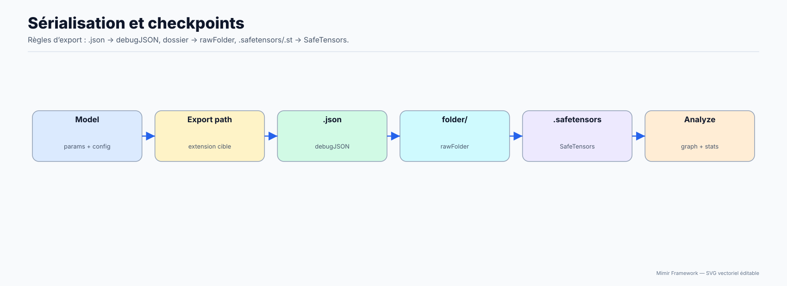
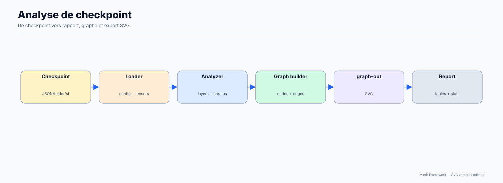

# Checkpoints / reprise d’entraînement

## Pour qui

Débutant à intermédiaire.

## Objectif

Sauvegarder, charger et reprendre sans perdre d'état utile.

## Avant de commencer

Avoir un modèle en mémoire (créé ou entraîné).

## Résultat attendu

Tu peux reprendre un run de manière fiable.

## Diagrammes d'explication







## Deux APIs existent

- `Mimir.Serialization.*` : API “moderne” (recommandée)
- `Mimir.Checkpoint.*` : legacy (dépréciée, alias)

## Sauvegarder

```lua
local ok, err = Mimir.Serialization.save("checkpoint/run1", "raw_folder", {
  save_optimizer = true,
  save_tokenizer = true,
  save_encoder = true,
  include_checksums = true,
  include_git_info = true,
})
assert(ok, err)
```

Note dtype : le dtype de stockage (f16/bf16/f32/f64) est contrôlé par `cfg.dtype` (recommandé) ou par `Mimir.Model.dtype("...")`. Lors d’un `load()`, si le checkpoint contient `model_config.dtype`, il est réappliqué au runtime.

Formats disponibles :

- `safetensors`
- `raw_folder`
- `debug_json`

## Charger

Auto-détection :

```lua
local ok, err = Mimir.Serialization.load("checkpoint/run1")
assert(ok, err)
```

Options utiles :

- `strict_mode` : rend les mismatches de shapes/clefs plus stricts.
- `validate_checksums` : vérifie les SHA256 si présents.

## Reprise (resume)

Bon pattern :

- garder un dossier fixe `out_dir`
- écrire dans des sous-dossiers `_interrupt_*` en cas de Ctrl+C
- reprendre via `scripts/modules/checkpoint_resume.lua`

VAEText : voir `scripts/training/train_vae_texte.lua`.
