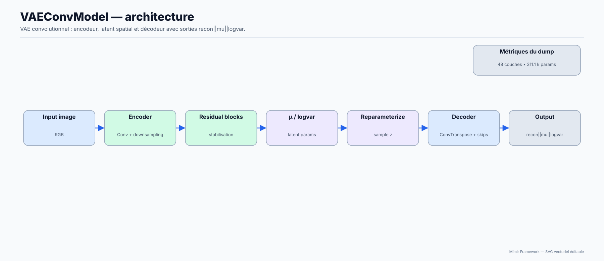
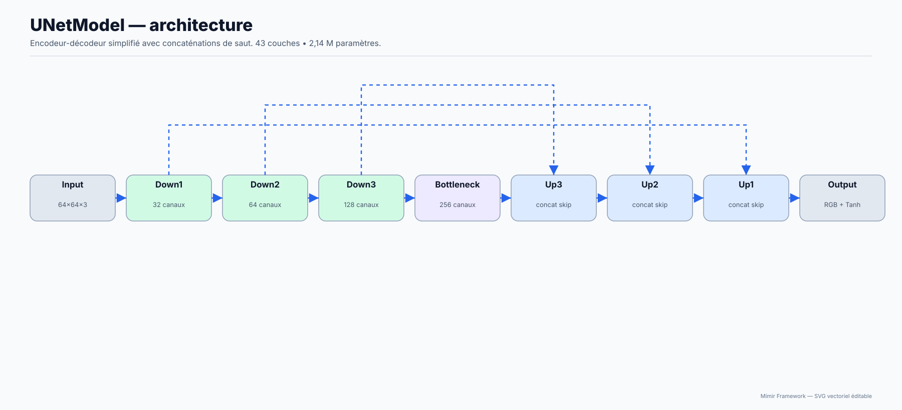
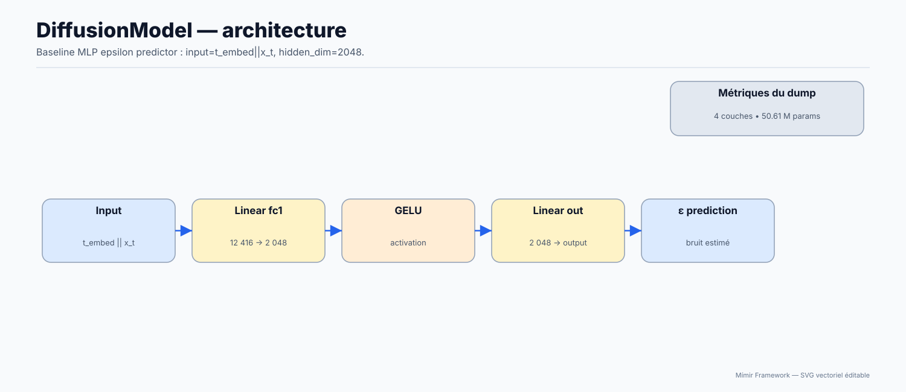
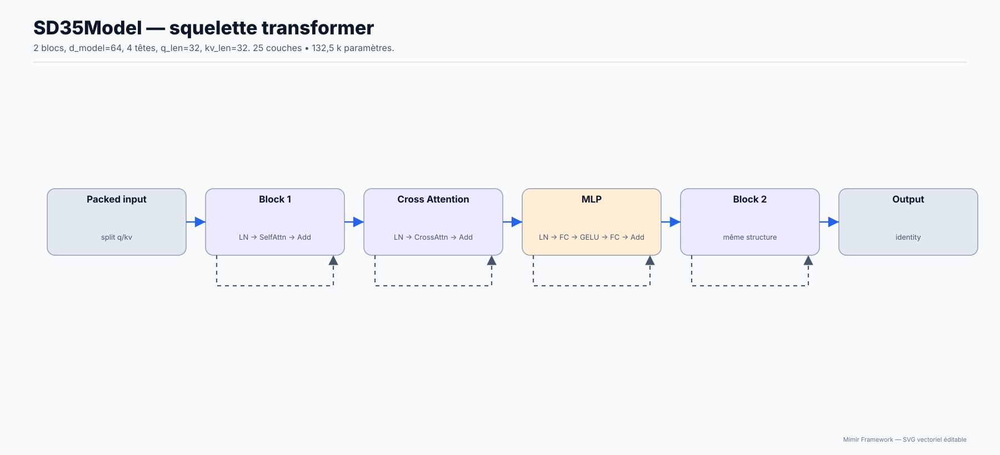

# Diffusion : SD3.5 et autoencodeurs

Comprendre et exécuter les chemins diffusion disponibles.

**Public concerné :** Intermédiaire guidé.

> **Prérequis**
>
> Checkpoints/config adaptés au modèle choisi.

## Diagrammes d'explication









Ce dépôt contient des architectures diffusion/autoencoder exposées via le registre.

Voir aussi:

- Exemples: `10-Examples.md`
- Datasets (linking par basename): `03-Data.md`
- Checkpoints: `08-Checkpoints.md`

## SD3.5 (skeleton / démos)

- Architecture : `sd3_5` (alias: `SD3.5`)
- Statut : squelette/placeholder enregistré, sans script de démonstration dédié dans
  le dépôt courant.

Inspection :

```bash
./bin/mimir --lua scripts/tools/inspect_architectures.lua -- \
  --list sd3_5 --params --layers
```

## Autoencoder image

- VAE conv : `vae_conv` (vision)
- Script training : `scripts/training/train_vae_conv.lua`

Astuce: commence par un VAE conv petit et valide le save/load avant d’attaquer une pipeline diffusion complète.

## Statut

Les scripts de diffusion sont des **démos / squelettes** tant qu’aucun checkpoint entraîné n’est fourni.
Pour générer des images cohérentes, il faut :

- un VAE image entraîné
- un U-Net/diffusion entraîné
- une config de scheduler cohérente

## Étapes suivantes

- [Page précédente : Tutoriel : Transformer causal (GPT-style)](12-Transformer-GPT.md)
- [Index de la documentation](../00-INDEX.md)
- [Page suivante : VAEConv : architecture, configuration et entraînement](14-VAEConv.md)
