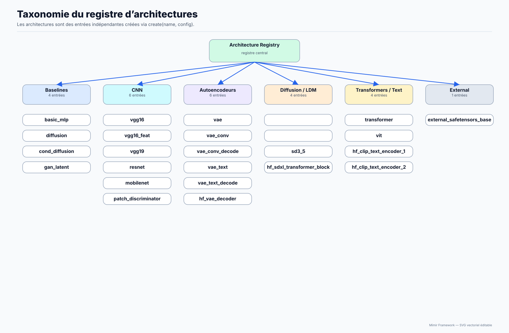
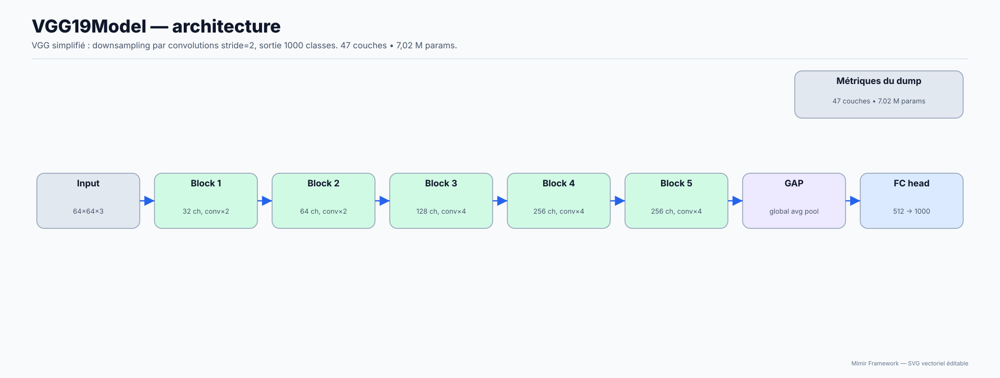
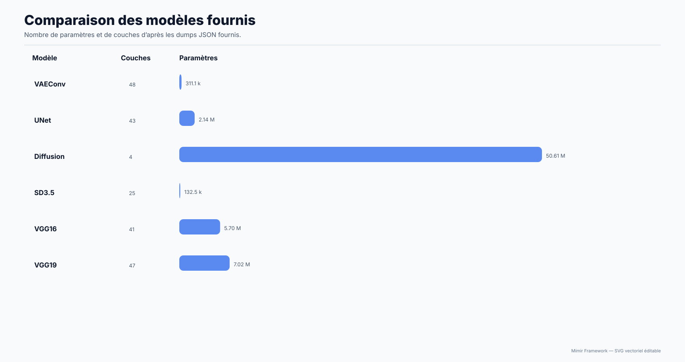

# `Mimir.Architectures`

Trouver rapidement le contrat API réel et les paramètres utilisables.

**Public concerné :** Développeur et utilisateur intermédiaire/avancé.

> **Prérequis**
>
> Connaître les commandes de base de Mímir.

## Sur cette page

- [Diagrammes d'explication](#diagrammes-dexplication)
- [available() -> table<string> | (nil, err)](#available---tablestring-nil-err)
- [defaultconfig(name: string) -> table | (nil, err)](#defaultconfigname-string---table-nil-err)
- [info(name?: string) -> ArchitectureInfo[] | ArchitectureInfo | (nil, err)](#infoname-string---architectureinfo-architectureinfo-nil-err)
- [dtypes() -> DTypeInfo[]](#dtypes---dtypeinfo)
- [Création de modèles](#création-de-modèles)
- [Alias / rétrocompat](#alias-rétrocompat)
- [Architectures disponibles](#architectures-disponibles)
- [Étapes suivantes](#étapes-suivantes)

## Diagrammes d'explication









Le registre d’architectures est la manière recommandée de créer des modèles.

Source : `src/Models/Registry/ModelArchitectures.cpp` et bindings `src/scriptings/Lua/luaScripting/LuaScripting.cpp`.

Ce module fournit :

- une liste des architectures disponibles
- des configs par défaut (faciles à surcharger)
- une normalisation de noms (alias/rétrocompat)
- une construction “safe” de modèles (avec métadonnées standardisées)

## `available() -> table<string> | (nil, err)`

Retourne la liste triée des architectures connues.

Notes :

- La liste provient du registre C++ (`ModelArchitectures::available()`), qui construit la liste à partir des entrées enregistrées.
- Les noms retournés sont les **noms canoniques** (après normalisation), triés.

## `default_config(name: string) -> table | (nil, err)`

Retourne la config par défaut (JSON -> table Lua).

Comportement :

- `name` passe par une phase de **canonicalisation** (voir section Alias).
- si l’architecture est inconnue : erreur.
- la config retournée sert de base : on peut ensuite fournir des overrides à la création.

## `info(name?: string) -> ArchitectureInfo[] | ArchitectureInfo | (nil, err)`

Lit **toutes les infos** du registry pour une (ou toutes les) architecture(s).

- Sans argument : renvoie la **liste complète** des entrées (`ArchitectureInfo[]`).
- Avec un `name` : renvoie l’entrée correspondante (`ArchitectureInfo`), ou `(nil, err)` si inconnue.

Chaque entrée est une table :

| Champ | Type | Description |
| --- | --- | --- |
| `name` | `string` | Nom canonique (clé du registry) |
| `description` | `string` | Description courte (peut être vide) |
| `config` | `table` | Config par défaut complète (peut contenir un champ `dtype`) |
| `origin` | `"native"` ou `"mpk"` | Origine explicite de l'entrée |
| `source_path` | `string?` | Chemin du package pour une entrée MPK |

Notes :

- C’est le seul accesseur qui expose la description et l’origine du registre C++.
- `config` est identique à ce que renvoie `default_config(name)`.
- `inspect_architectures.lua -a` affiche les noms natifs en cyan et les noms
  issus d’un MPK en magenta.

Exemple :

```lua
for _, entry in ipairs(Mimir.Architectures.info()) do
  print(entry.name, entry.description)
end
```

## `dtypes() -> DTypeInfo[]`

Liste les **dtypes pris en charge** par le framework (source : `src/DType.hpp`).

Chaque entrée est une table :

| Champ | Type | Description |
| --- | --- | --- |
| `name` | `string` | Nom canonique (ex: `float32`, `bfloat16`) |
| `aliases` | `string` | Alias acceptés, séparés par des virgules (ex: `f32, float32`) |
| `bytes` | `integer` | Taille en octets d’un élément |
| `kind` | `string` | Famille : `float` / `int` / `uint` / `bool` |

Le **dtype par défaut** d’une architecture est le champ `config.dtype` s’il est présent,
sinon `float32` (défaut global du modèle). On peut le changer via `Mimir.model.dtype(name)`
ou via un override `dtype=...` à la création.

Exemple :

```lua
for _, dt in ipairs(Mimir.Architectures.dtypes()) do
  print(dt.name, dt.bytes, dt.kind, dt.aliases)
end
```

> Astuce : le script `scripts/tools/inspect_architectures.lua` affiche tout cela
> sous forme de tableaux colorés (`-a` pour archis + dtypes, `-l <arch> -p` pour
> les paramètres d’une archi, `-d` pour les dtypes seuls).

## Création de modèles

> **IMPORTANT:** `Mimir.Architectures.create()` n'existe PAS. Utilisez `Mimir.Model.create(name, cfg)` à la place.

## Alias / rétrocompat

Quelques noms sont normalisés par `canonicalArchName`.

Canonicalisation observée dans le registre C++ :

- variantes conviviales `SD3.5` / `sd3.5` / `SD3_5` -> `sd3_5`

---

## Architectures disponibles

Le registre C++ contient actuellement 25 entrées natives canoniques :

| Famille | Architectures |
| --- | --- |
| Général | `basic_mlp` |
| Texte | `causal_lm`, `transformer`, `vae_text`, `vae_text_decode`, `hf_clip_text_encoder_1`, `hf_clip_text_encoder_2` |
| Vision | `vit`, `vae`, `vae_conv`, `vae_conv_decode`, `resnet`, `unet`, `mobilenet`, `vgg16`, `vgg19`, `vgg16_feat`, `hf_vae_decoder` |
| Diffusion/latent | `diffusion`, `cond_diffusion`, `sd3_5`, `hf_sdxl_transformer_block`, `gan_latent` |
| Discrimination/import | `patch_discriminator`, `external_safetensors_base` |

Cette liste décrit les clés effectivement enregistrées. Les alias acceptés peuvent
être canonicalisés vers une autre entrée. Pour ne jamais dépendre d’une liste
documentaire potentiellement ancienne :

```bash
./bin/mimir --lua scripts/tools/inspect_architectures.lua -- -a
```

Le nombre affiché au démarrage peut être supérieur : les sources `.mpk` et
binaires `.mpk.bin` présentes dans `_archi/` sont ajoutées dynamiquement.
Le dépôt fournit actuellement `r_cnn`, `yolo`, `ssd`, `deeplab` et
`vae_conv_pseudocode`. Voir
[MPK : packages d’architecture](../02-User-Guide/15-MPK.md).

Les quatre architectures de vision MPK sont des prototypes à délégation :

| MPK | Fabrique native utilisée | Statut |
| --- | --- | --- |
| `r_cnn` | `vgg16` | backbone exécutable, tête R-CNN documentaire |
| `yolo` | `mobilenet` | backbone exécutable, neck/têtes YOLO documentaires |
| `ssd` | `vgg16` | backbone exécutable, têtes MultiBox documentaires |
| `deeplab` | `resnet` | backbone exécutable, ASPP/décodeur documentaires |

Leur présence dans `available()` ne signifie pas encore que ROI, décodage de
boîtes ou convolution atrous spécialisée sont implémentés. NMS est disponible
comme layer runtime CPU et figure dans les graphes documentaires R-CNN, YOLO et
SSD.

La présence dans le registre signifie que le builder existe. Elle ne signifie pas
que l’architecture est complète pour tous les usages : `sd3_5` est explicitement
un squelette/placeholder et `external_safetensors_base` sert à refléter un
checkpoint, pas à exécuter une inférence autonome.

### Modèles MLP

**`basic_mlp`** — MLP simple

Config par défaut :
```json
{
  "input_dim": 256,
  "hidden_dim": 256,
  "output_dim": 256,
  "hidden_layers": 2,
  "dropout": 0.0
}
```

### Modèles NLP (Transformers)

**`transformer`** — Transformer encodeur/décodeur

```json
{
  "seq_len": 64, "d_model": 128, "vocab_size": 4096,
  "num_layers": 4, "num_heads": 4, "mlp_hidden": 256,
  "output_dim": 256, "causal": false
}
```

**`vae_text`** — VAE texte latent

```json
{
  "vocab_size": 32000, "seq_len": 256,
  "d_model": 256, "num_layers": 4,
  "latent_tokens": 32, "stochastic_latent": true
}
```
Sortie : `[logits(seq*vocab) || mu(latent_dim) || logvar(latent_dim) || img_proj || text_proj]`

### Modèles Vision

**`unet`** — U-Net image-vers-image

```json
{ "image_w": 64, "image_h": 64, "image_c": 3, "base_channels": 32, "depth": 3 }
```

**`vae`** — VAE standard (MLP latent)

```json
{ "image_w": 64, "image_h": 64, "image_c": 3, "latent_dim": 128, "hidden_dim": 1024 }
```

**`vae_conv`** — VAE convolutionnel (recommandé pour les images)

```json
{
  "image_w": 64, "image_h": 64, "image_c": 3,
  "latent_h": 16, "latent_w": 16, "latent_c": 256,
  "base_channels": 64, "stochastic_latent": false,
  "use_attention": true, "resnet_max_tokens": 0,
  "use_attn": false, "attn_heads": 4, "attn_max_tokens": 0,
  "enc_norm": "groupnorm", "enc_gn_groups": 32,
  "dec_norm": "groupnorm", "dec_gn_groups": 32,
  "decoder_upsample": "conv_transpose",
  "use_skip_connections": false,
  "use_encoder_prior": false,
  "text_cond": false, "seq_len": 64,
  "text_d_model": 256, "proj_dim": 256
}
```

Contrat de sortie :

```text
recon[image_dim] || mu[latent_dim] || logvar[latent_dim]
```

Si `text_cond=true`, la sortie ajoute `img_proj[proj_dim] || txt_proj[proj_dim]`.

Points importants :

- `use_attention` est un nom historique qui active les **ResBlocks** ;
- `use_attn` active réellement la SelfAttention spatiale ;
- `attn_max_tokens=0` signifie aucune limite et peut être très coûteux ;
- `use_encoder_prior=true` ajoute un biais latent global apprenable à `z`, sans modifier la zone `mu` de la sortie ;
- `stochastic_latent=false` donne `z=mu`, alors que `true` active la réparamétrisation pendant l’entraînement ;
- les ratios `image_h/latent_h` et `image_w/latent_w` doivent être identiques et être une puissance de deux.

Guide détaillé : [VAEConv : architecture, configuration et entraînement](../02-User-Guide/14-VAEConv.md).

**`vae_conv_decode`** — Décodeur VAEConv autonome

Il prend un latent CHW aplati de taille `latent_dim` et produit une image HWC aplatie de taille `image_dim`. Il reconstruit les noms de layers du décodeur principal afin de charger les poids compatibles. Si le VAE complet utilisait des skips encodeur, le décodeur autonome les remplace par des tenseurs zéro fixes : son résultat n’est donc pas strictement équivalent au chemin complet avec skips.

**`vit`** — Vision Transformer (ViT)

```json
{
  "num_tokens": 197, "d_model": 128, "num_layers": 4,
  "num_heads": 4, "mlp_hidden": 256, "output_dim": 1000
}
```

**`resnet`** — ResNet-18 like  
**`vgg16`** / **`vgg19`** — VGG classique  
**`vgg16_feat`** — extracteur de caractéristiques VGG16

```json
{
  "image_w": 64, "image_h": 64, "image_c": 3,
  "base_channels": 8,
  "enc_norm": "lineargroup", "enc_gn_groups": 32
}
```

`enc_norm` accepte `lineargroup` (LayerNorm globale historique sur `C*H*W`)
ou `groupnorm`. Pour `groupnorm`, chaque bloc choisit le plus grand diviseur du
nombre de canaux inférieur ou égal à `enc_gn_groups`.

**`mobilenet`** — MobileNet v1 like

### Discriminateurs

**`gan_latent`** — Discriminateur MLP latent  
**`patch_discriminator`** — PatchGAN discriminator

### Modèles Diffusion

**`diffusion`** — eps-predictor basique

```json
{
  "image_w": 64, "image_h": 64, "image_c": 3,
  "time_dim": 128, "hidden_dim": 2048, "dropout": 0.0
}
```

**`cond_diffusion`** — Diffusion conditionnée (prompt embedding)

```json
{
  "prompt_dim": 128, "latent_w": 32, "latent_h": 32, "latent_c": 4,
  "time_dim": 128, "hidden_dim": 2048
}
```

**`sd3_5`** — Placeholder SD3.5 (stub)

```json
{ "stub_only": false, "q_len": 32, "kv_len": 32, "d_model": 64, "num_heads": 4, "num_layers": 2 }
```

### Modèles HuggingFace / SDXL (checkpoints externes)

Ces architectures sont conçues pour charger/refléter des checkpoints HuggingFace/PyTorch
(SDXL notamment). Utilisez-les avec un mapping JSON et `Mimir.Serialization.load(...)`.
Voir les scripts d'exemple dans `scripts/inferences/`.

**`external_safetensors_base`** — Base non-exécutable qui reflète exactement les clés d'un
checkpoint safetensors externe (utile pour inspecter/mapper un fichier source).

```json
{ "source_safetensors": "", "max_tensors": 0 }
```

Champs optionnels supplémentaires : `include_prefixes` / `exclude_prefixes`
(listes de préfixes pour filtrer les tenseurs créés).

**`hf_clip_text_encoder_1`** — Encodeur texte CLIP/SDXL exécutable
(`conditioner.embedders.0`).

```json
{
  "vocab_size": 49408, "padding_idx": 0, "seq_len": 77, "d_model": 768,
  "num_layers": 12, "num_heads": 12, "mlp_hidden": 3072, "causal": true
}
```

**`hf_clip_text_encoder_2`** — Encodeur texte OpenCLIP/SDXL exécutable
(`conditioner.embedders.1`), avec projection et logit scale optionnels.

```json
{
  "vocab_size": 49408, "padding_idx": 0, "seq_len": 77, "d_model": 1280,
  "num_layers": 32, "num_heads": 20, "mlp_hidden": 5120,
  "proj_dim": 1280, "causal": true, "include_logit_scale": true
}
```

**`hf_sdxl_transformer_block`** — Bloc transformer SDXL exécutable
(SelfAttention + CrossAttention + FeedForward).

```json
{
  "q_len": 64, "kv_len": 77, "d_model": 640, "context_dim": 2048,
  "num_heads": 10, "ff_hidden": 2560,
  "self_attn_qkv_bias": false, "self_attn_out_bias": true, "cross_attn_out_bias": true
}
```

**`hf_vae_decoder`** — Décodeur VAE SDXL exécutable
(`first_stage_model.decoder`).

```json
{
  "image_w": 512, "image_h": 512, "image_c": 3,
  "latent_w": 64, "latent_h": 64, "latent_c": 4,
  "num_heads": 1, "norm_groups": 32
}
```

> Les valeurs ci-dessus sont indicatives : utilisez
> `Mimir.Architectures.default_config(name)` (ou `info(name)`) pour obtenir la config
> exacte à jour côté runtime.

## Étapes suivantes

- [Page précédente : API : `Mimir.Model`](10-Model.md)
- [Index de la documentation](../00-INDEX.md)
- [Page suivante : API : `Mimir.Tokenizer`](12-Tokenizer.md)
