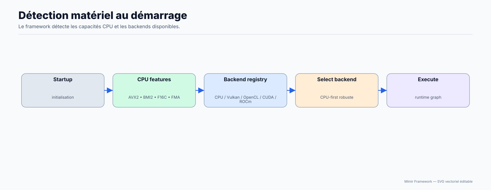

# Backends hardware : CPU / CUDA / ROCm / Vulkan / OpenCL

## Pour qui

Développeur avancé qui modifie le moteur C/C++.

## Objectif

Comprendre le fonctionnement interne exact des composants runtime.

## Avant de commencer

Connaître les bases C++ et la structure du dépôt.

## Résultat attendu

Tu peux modifier le code interne en limitant les régressions.

## Diagrammes d'explication




Ce document décrit l'architecture interne du système de runtimes de Mímir : comment les layers sont dispatchés vers les différents backends matériels, comment `RuntimeConfig` est configuré, et comment chaque fast-path est implémenté en C++.

> **Public visé :** développeurs qui souhaitent comprendre ou modifier les runtimes. Si vous cherchez simplement à activer l'accélération GPU, lisez [le guide utilisateur GPU](../05-Advanced/05-GPU-Acceleration.md) à la place.

**Fichiers sources de référence :**

| Fichier | Rôle |
|---|---|
| `src/runtimes/AbstractRuntime.hpp` | Interface commune + struct `RuntimeConfig` |
| `src/runtimes/cpu/CpuRuntime.cpp` | Implémentation CPU (fallback universel) |
| `src/runtimes/cuda/CudaRuntime.cpp` | Fast-paths cuBLAS (CUDA) |
| `src/runtimes/rocm/RocmRuntime.cpp` | Fast-paths rocBLAS (ROCm/HIP) |
| `src/runtimes/vulkan/VulkanCompute.hpp` | Compute Vulkan (Linear, MatMul/BatchMatMul, Add/Multiply, ReLU/SiLU/GELU/Sigmoid/Tanh) |
| `src/runtimes/opencl/OpenCLCompute.hpp` | Compute OpenCL (legacy) |
| `CMakeLists.txt` | Flags de compilation : `ENABLE_CUDA`, `ENABLE_ROCM`, `ENABLE_VULKAN` |

---

## Architecture générale

### L'interface `AbstractRuntime`

Tous les backends implémentent la même interface C++ :

```cpp
class AbstractRuntime {
public:
    // Initialise le backend à partir de sa configuration (détectée via env vars)
    virtual bool initialize(const RuntimeConfig& cfg) = 0;

    // Tente d'exécuter un layer. Retourne false si ce layer n'est pas supporté
    // ou si les seuils ne sont pas atteints → Model.cpp retombe sur le runtime suivant.
    virtual bool forwardLayer(
        const std::vector<const std::vector<float>*>& inputs,
        std::vector<std::vector<float>>& outputs,
        const Layer& layer,
        bool training) = 0;
};
```

`forwardLayer()` retourne `false` pour signaler "je ne peux pas gérer ce layer" — ce n'est pas une erreur, c'est le mécanisme de fallback.

La sélection des opérations dans les runtimes suit une convention explicite : **switch (`LayerType`)** dans `forwardLayer(...)` (pas de chaîne de `if` sur le type).

### Ordre de dispatch réellement exécuté

Le forward s'appuie sur le `RuntimeRouter`, qui parcourt les backends initialisés par ordre de priorité et appelle `forwardLayer(...)`.

```
1. CUDA (si compilé, initialisé et activé)
2. ROCm (si compilé, initialisé et activé)
3. Vulkan (si compilé, initialisé et activé)
4. OpenCL (si compilé, initialisé et activé)
5. CPU (fallback universel)
```

Chaque backend décide via son `switch (layer.type_enum)` s'il peut traiter l'opération. Si le backend retourne `false`, le router essaie le suivant.

### Le pattern "do-while-false" dans les runtimes GPU

Chaque fast-path GPU dans `CudaRuntime::forwardLayer` / `RocmRuntime::forwardLayer` est encapsulé dans un bloc `do { ... } while(false)`. En cas d'échec (buffer device insuffisant, opération non supportée, etc.), le code fait `break` pour sortir proprement du bloc, puis retourne `false` :

```cpp
// Exemple simplifié du fast-path Linear
bool CudaRuntime::forwardLayer(...) {
    if (layer.type == LayerType::Linear) {
        do {
            if (!config_.linear_enabled) break;
            if (compute_ops < config_.linear_min_ops) break;

            DeviceBuf d_input, d_weight, d_output;
            if (!d_input.alloc(...)) break;
            // ... appels cuBLAS ...
            cudaDeviceSynchronize();
            d_output.copyToHost(...);
            return true;  // succès
        } while (false);
        return false;  // fallback → CPU
    }
    return false;
}
```

> **Note :** ce pattern est actif dans les runtimes GPU et fonctionne avec le dispatch du `RuntimeRouter`.

---

## `RuntimeConfig` — configuration commune

`RuntimeConfig` est la structure partagée par tous les runtimes GPU. Elle est peuplée une seule fois au démarrage via `RuntimeConfig::fromEnv(backend_upper)`, qui lit les variables d'environnement correspondant au backend.

```cpp
struct RuntimeConfig {
    bool disabled        = false;
    bool verbose         = false;
    int  device_index    = 0;

    bool linear_enabled  = false;
    int  linear_min_ops  = 1 << 20;   // 1 048 576 MACs (~1 M)

    bool conv_enabled    = false;
    int  conv_min_ops    = 1 << 18;   // 262 144 MACs (~256 K)

    bool norm_enabled       = false;
    int  norm_min_elements  = 1 << 12; // 4 096 éléments

    bool attention_enabled = false;
    int  attention_min_ops = 1 << 18;  // 262 144 MACs (~256 K)

    static RuntimeConfig fromEnv(const char* backend_upper);
    // Exemple : fromEnv("CUDA") lit MIMIR_CUDA_*, fromEnv("ROCM") lit MIMIR_ROCM_*
};
```

### Variables d'environnement (CUDA — remplacer `CUDA` par `ROCM` pour AMD)

| Variable | Valeur | Effet |
|---|---|---|
| `MIMIR_DISABLE_CUDA` | `1` | Désactive complètement le runtime CUDA |
| `MIMIR_ACCEL_VERBOSE` | `1` | Log les décisions de dispatch (utile pour le diagnostic) |
| `MIMIR_CUDA_DEVICE` | entier | Index du GPU à utiliser (défaut : `0`) |
| `MIMIR_CUDA_LINEAR` | `1` | Active le fast-path `Linear` |
| `MIMIR_CUDA_LINEAR_MIN_OPS` | entier | Seuil MACs pour `Linear` (défaut runtime : `0`) |
| `MIMIR_CUDA_CONV` | `1` | Active le fast-path `Conv2d` |
| `MIMIR_CUDA_CONV_MIN_OPS` | entier | Seuil MACs pour `Conv2d` (défaut runtime : `0`) |
| `MIMIR_CUDA_NORM` | `1` | Active le fast-path `LayerNorm` / `RMSNorm` |
| `MIMIR_CUDA_NORM_MIN_ELEMS` | entier | Seuil éléments pour les norms (défaut runtime : `0`) |
| `MIMIR_CUDA_ATTENTION` | `1` | Active le fast-path `Attention` |
| `MIMIR_CUDA_ATTENTION_MIN_OPS` | entier | Seuil MACs pour Attention (défaut runtime : `0`) |

> **Portée effective aujourd'hui :** le dispatch principal passe par le `RuntimeRouter`; les fast-paths `LINEAR`/`CONV`/`NORM`/`ATTENTION` de CUDA/ROCm sont pris en compte quand activés.

---

## Backend CUDA (cuBLAS)

**Prérequis build :** `-DENABLE_CUDA=ON`. Dépendances CMake : `CUDA::cudart`, `CUDA::cublas`.

### Fast-path Linear (SGEMM)

Calcule `output[M,N] = input[M,K] × W[K,N]` via `cublasSgemm`, puis ajoute le biais via `cublasSaxpy`.

**Seuil de déclenchement :** `M × N × K ≥ linear_min_ops` (défaut ~1 M MACs).

### Fast-path Conv2d (im2col + SGEMM)

Les convolutions ne sont pas directement supportées par cuBLAS, mais peuvent être réduites à une multiplication matricielle via la transformation **im2col**.

**Statut de dispatch :** implémenté dans `CudaRuntime::forwardLayer` et appelé via `RuntimeRouter`.

1. **im2col sur CPU** — le tenseur d'entrée `[C, H, W]` est réorganisé en matrice `col[C·kH·kW, H_out·W_out]` qui "aplatit" chaque fenêtre de convolution en une colonne.
2. **Transfert vers GPU** — `col` et les filtres `W` sont copiés en VRAM.
3. **SGEMM sur GPU** — `output = W_flat × col` via `cublasSgemm`.
4. **Biais via `cublasSger`** — outer product pour broadcaster le biais sur toutes les positions spatiales.

Supporte : `stride`, `padding`, `dilation`.

> **Important :** ce fast-path est **désactivé en mode `training=true`**. Le backward de la convolution (gradients des filtres et de l'entrée) n'est pas encore implémenté en GPU. En training, Conv2d retombe toujours sur le CPU.

### Fast-path LayerNorm / RMSNorm (hybride CPU+GPU)

La normalisation elle-même est conservée sur CPU (calcul de la moyenne et variance, opération de normalisation), mais l'étape **affine** (mise à l'échelle `gamma` + décalage `beta`) est accélérée sur GPU via :
- `cublasSdgmm` — multiplication terme à terme par `gamma`
- `cublasSaxpy` — ajout de `beta`

Ce découpage hybride donne un bon rapport perf/complexité sans avoir à porter le calcul de variance sur CUDA.

**Statut de dispatch :** implémenté dans `CudaRuntime::forwardLayer` et appelé via `RuntimeRouter`.

`GroupNorm` et `BatchNorm2d` restent entièrement sur CPU (layout de mémoire incompatible avec cette stratégie).

### Fast-path Attention (multi-SGEMM)

Pour `SelfAttention`, `MultiHeadAttention` et `CrossAttention` :

1. **Projection QKV sur GPU** — `Q`, `K`, `V` sont calculés via trois SGEMM.
2. **Split Q/K/V sur CPU** — division des têtes.
3. **Par tête en boucle :**
   - Scores : `S = Q × Kᵀ` via `cublasSgemm` avec `CUBLAS_OP_T`
   - Masque causal optionnel (appliqué sur CPU)
   - Softmax (appliqué sur CPU, ligne par ligne)
   - Contexte : `ctx = S × V` via `cublasSgemm`
4. **Projection de sortie sur GPU** — SGEMM final.

Pour `CrossAttention`, `Q` et `KV` proviennent de deux sources différentes (`qlen ≠ kvlen` est supporté).

**Statut de dispatch :** implémenté dans `CudaRuntime::forwardLayer` et appelé via `RuntimeRouter`.

### `DeviceBuf` — helper de buffer device

`DeviceBuf` est une RAII-wrapper autour d'un buffer CUDA. Il garantit que `cudaFree` est toujours appelé, même en cas d'exception :

```cpp
struct Impl::DeviceBuf {
    void*  ptr  = nullptr;
    size_t size = 0;

    bool alloc(size_t bytes);           // cudaMalloc
    bool copyFromHost(const void* src, size_t bytes);  // cudaMemcpy H→D
    bool copyToHost(void* dst, size_t bytes);           // cudaMemcpy D→H
    ~DeviceBuf();                       // cudaFree automatique
};
```

Chaque fast-path alloue ses `DeviceBuf` localement dans le bloc `do { ... } while(false)`. Si l'allocation échoue (VRAM insuffisante), le `break` libère les buffers déjà alloués via leur destructeur.

---

## Backend ROCm (rocBLAS)

**Prérequis build :** `-DENABLE_ROCM=ON`. Dépendances CMake : `hip::host`, `roc::rocblas`.

L'implémentation est **fonctionnellement identique** au backend CUDA. Les correspondances API sont directes :

| CUDA | ROCm/HIP |
|---|---|
| `cudaMalloc` / `cudaFree` | `hipMalloc` / `hipFree` |
| `cudaMemcpy` | `hipMemcpy` |
| `cudaDeviceSynchronize` | `hipDeviceSynchronize` |
| `cublasSgemm` | `rocblas_sgemm` |
| `cublasSger` | `rocblas_sger` |
| `cublasSdgmm` | `rocblas_sdgmm` |
| `cublasSaxpy` | `rocblas_saxpy` |

Le code est conditionnel via `#ifdef ENABLE_ROCM` / `#endif`. Les variables d'environnement utilisent le préfixe `MIMIR_ROCM_*`.

**Statut de dispatch :** même logique que CUDA; `forwardLayer()` est utilisé via `RuntimeRouter`.

---

## Backend CPU

Le backend CPU est toujours actif. Il n'a pas de seuils ni de configuration : il traite tous les layers que les runtimes GPU ont refusés.

Implémenté via `RuntimeLayerDispatch::cpu_forward_layer`, qui délègue aux fonctions dans `src/LayerOps.hpp` et `src/LayerOpsExt.hpp`.

**Optimisations CPU disponibles :**

```cpp
bool Model::hasAVX2();  // Extensions vectorielles 256-bit
bool Model::hasFMA();   // Fusion multiply-add matérielle
bool Model::hasF16C();  // Conversion float16 native
bool Model::hasBMI2();  // Manipulation de bits avancée
```

Les boucles dans `LayerOps` sont parallélisées via **OpenMP** si activé au build.

---

## Backends Vulkan / OpenCL

Ces backends sont exposés via runtimes dédiés (`VulkanRuntime` / `OpenCLRuntime`) et routés par `RuntimeRouter`.

En pratique:

- Vulkan couvre `Linear`, `MatMul`, `BatchMatMul`, `Add`, `Multiply`, `ReLU` (forward).
- OpenCL couvre `Linear`, `MatMul`, `BatchMatMul` (forward).

| Backend | Build flag | Scope | Variables |
|---|---|---|---|
| Vulkan | `ENABLE_VULKAN` | Linear + MatMul/BatchMatMul + Add/Multiply/ReLU (forward) | `MIMIR_VULKAN_LINEAR_SPV`, `MIMIR_VULKAN_LINEAR` |
| OpenCL | `ENABLE_OPENCL` | Linear + MatMul/BatchMatMul (inférence) | `MIMIR_OPENCL_LINEAR` |

---

## Tableau de synthèse

| Layer | CPU | CUDA | ROCm | Vulkan |
|---|---|---|---|---|
| `Linear` | ✓ ref | ✓ routé via RuntimeRouter | ✓ routé via RuntimeRouter | ✓ routé via RuntimeRouter |
| `Conv2d` | ✓ ref | ✓ routé via RuntimeRouter | ✓ routé via RuntimeRouter | ✗ |
| `LayerNorm` | ✓ ref | ✓ routé via RuntimeRouter | ✓ routé via RuntimeRouter | ✗ |
| `RMSNorm` | ✓ ref | ✓ routé via RuntimeRouter | ✓ routé via RuntimeRouter | ✗ |
| `GroupNorm` | ✓ ref | ✗ fallback | ✗ fallback | ✗ |
| `BatchNorm2d` | ✓ ref | ✗ fallback | ✗ fallback | ✗ |
| `SelfAttention` | ✓ ref | ✓ routé via RuntimeRouter | ✓ routé via RuntimeRouter | ✗ |
| `MultiHeadAttention` | ✓ ref | ✓ routé via RuntimeRouter | ✓ routé via RuntimeRouter | ✗ |
| `CrossAttention` | ✓ ref | ✓ routé via RuntimeRouter | ✓ routé via RuntimeRouter | ✗ |
| `Add` | ✓ ref | ✗ fallback | ✗ fallback | ✓ routé via RuntimeRouter |
| `Multiply` | ✓ ref | ✗ fallback | ✗ fallback | ✓ routé via RuntimeRouter |
| `ReLU` | ✓ ref | ✗ fallback | ✗ fallback | ✓ routé via RuntimeRouter |
| Tous les autres | ✓ ref | ✗ fallback | ✗ fallback | ✗ |

> **Note explicite :** le forward principal route via `RuntimeRouter`; les runtimes peuvent refuser une op et laisser le fallback CPU prendre le relais.

---

## Voir aussi

- [Guide utilisateur GPU](../05-Advanced/05-GPU-Acceleration.md) — activer et configurer l'accélération
- [GPU Runtimes — internals](./21-GPU-Runtimes.md) — guide pour étendre les runtimes
- [Planning](./22-Planning.md) — analyse statique du graphe, fusions et scratchpads
