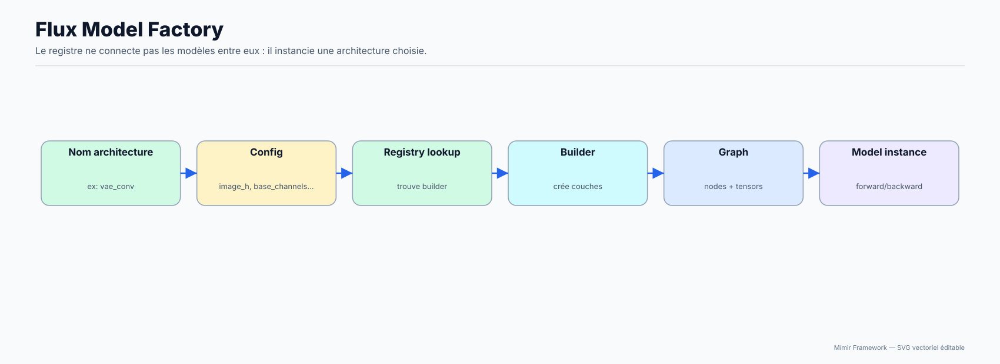
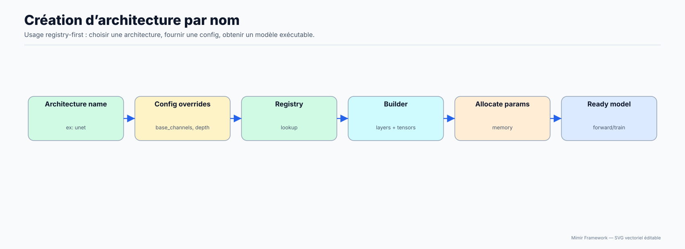

# Registre d’architectures et builders

Cette page explique comment le registre transforme une configuration JSON en
instance de `Model`, puis comment les builders construisent sa topologie.

**Public concerné :** Développeur avancé qui modifie le moteur C/C++.

> **Prérequis**
>
> Connaître les bases C++ et la structure du dépôt.

## Diagrammes d'explication

Source de vérité :

- API : `src/Models/Registry/ModelArchitectures.hpp`
- Implémentation : `src/Models/Registry/ModelArchitectures.cpp`
- Builders : `src/Models/**` (ex: MLP/Transformer/Diffusion)
- `Model::push` + routing : `src/Model.hpp`, `src/Model.cpp`

## 1) Concepts

- Une **architecture** = un nom + une config par défaut + une fonction `create(cfg)`.
- La config est un JSON (`nlohmann::json`).
- `create` instancie généralement une classe dérivée (ou configure un `Model`) et construit la liste de `Layer`.

## 2) API publique

Dans `ModelArchitectures.hpp` :

- `available()` : liste des archis.
- `defaultConfig(name)` : config par défaut.
- `create(name, cfg)` : instancie un modèle.

Sous le capot :

- `Registry::ensureBuiltinsRegistered()` enregistre les entrées (lazy via `std::once_flag`).

## 3) Invariants de build

- Le build doit définir `params_count` correctement pour chaque layer.
- Le wiring doit être cohérent (`Layer.inputs/output`).
- Après build :
  - `allocateParams()` doit pouvoir allouer les blocs.
  - `initializeWeights()` doit pouvoir initialiser selon la méthode.

## 4) Où le registre est utilisé

- CLI : `src/main.cpp` (`--config` et `--conf`)
- Lua : `LuaScripting` (`Mimir.Architectures.*` et `Mimir.Model.create`)

## Étapes suivantes

- [Page précédente : Internals : `RuntimeAllocator` et scratchpads](18-RuntimeAllocator-And-Scratchpads.md)
- [Index de la documentation](../00-INDEX.md)
- [Page suivante : Internals : CLI (binaire `mimir`) et points d’entrée](20-CLI-EntryPoints.md)
