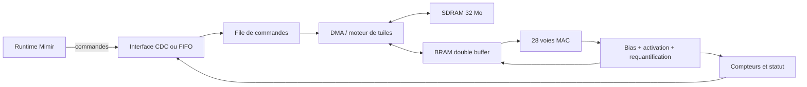

# Etude d'un runtime FPGA pour iCESugar-Pro v1.3

## Resume executif

La carte cible est une **MuseLab iCESugar-Pro v1.3**, equipee d'un FPGA Lattice
ECP5 `LFE5U-25F-6BG256C`, de 32 Mo de SDRAM et d'un programmateur iCELink.
Elle peut accelerer des noyaux specialises en entier fixe, mais elle ne doit pas
etre traitee comme un GPU generaliste.

La recommandation est de commencer par un accelerateur d'inference `INT8` pour
un sous-graphe `Conv2d + bias + ReLU/SiLU`, avec poids persistants en SDRAM et
buffers de tuiles en BRAM. Le CDC serie de l'iCELink doit rester un plan de
controle et de validation. Il est trop lent pour decharger une couche a la fois
sur de grandes activations. Un lien de donnees externe d'au moins 20 a 50 Mo/s,
ou l'execution de plusieurs couches consecutives sans retour vers le CPU, est
necessaire pour obtenir un gain de bout en bout.

Verdict par objectif :

| Objectif | Faisabilite | Verdict |
| --- | ---: | --- |
| Apprentissage FP32 complet | Tres faible | Ressources DSP et memoire insuffisantes |
| Backward / mise a jour AdamW | Tres faible | Ne pas cibler en premiere version |
| Inference FP32 couche par couche | Faible | CPU SIMD probablement plus rapide |
| Inference INT8 specialisee | Bonne | Cible recommandee |
| CPU et FPGA sur branches independantes | Moyenne | Necessite un ordonnanceur asynchrone |
| Pipeline de plusieurs couches resident sur FPGA | Bonne | Meilleur moyen d'amortir les transferts |

## Materiel disponible

D'apres la documentation publique de l'iCESugar-Pro :

- 24K LUT ;
- 28 multiplicateurs materiels 18 x 18 ;
- 1 008 Kbits de RAM bloc, soit environ 126 Kio ;
- 194 Kbits de RAM distribuee, soit environ 24 Kio ;
- 32 Mo de SDRAM `IS42S16160B`, bus 16 bits ;
- oscillateur 25 MHz et une PLL ;
- iCELink avec programmation JTAG et port USB CDC relie au FPGA ;
- 106 E/S utilisables sur le connecteur SODIMM.

Le texte de firmware fourni identifie l'iCELink, pas le FPGA. Le modele de carte
confirme par l'utilisateur leve cette ambiguite. Le `Unique ID` est celui du
debugger et ne constitue pas une mesure des ressources du FPGA.

### Plafond de calcul

Avec un MAC par DSP et par cycle, le plafond theorique est :

$$
P_{MAC} = 28 \times f
$$

A 100 MHz, cela donne environ 2,8 GMAC/s, ou 5,6 GOP/s si une multiplication et
une addition sont comptees comme deux operations. Ce chiffre ne tient pas compte
des bulles de pipeline, des bords de convolution, de la SDRAM ni du routage.
Une premiere cible realiste est 60 a 80 % de ce plafond sur un noyau regulier,
soit environ 1,7 a 2,2 GMAC/s.

Le FP32 n'est pas une bonne representation pour cette puce. Une multiplication
flottante consommerait plusieurs DSP et beaucoup de LUT. Les formats conseilles
sont :

- poids et activations `INT8` avec zero-point nul en premiere version ;
- accumulateurs signes de 32 bits ;
- biais `INT32` ;
- requantification par multiplicateur et decalage par canal ;
- eventuellement `INT16` pour les couches dont l'erreur INT8 est excessive.

## Le goulot d'etranglement iCELink

Le port CDC est un pont serie pratique, pas une interconnexion d'accelerateur.
Son debit utile doit etre mesure, mais meme un UART a 3 Mbit/s ne transporte
qu'environ 0,3 Mo/s avec 8 bits de donnees et les bits de trame.

Une activation `512 x 512 x 8` represente :

- 8 Mio en FP32 ;
- 4 Mio en INT16 ;
- 2 Mio en INT8.

A 0,3 Mo/s, un seul transfert INT8 prend environ 7 secondes, avant meme le
retour du resultat. L'offload couche par couche ne peut donc pas accelerer ce
cas. Le port CDC est adapte aux commandes, registres, petits vecteurs de test,
compteurs de performance et diagnostics.

Trois options de plan de donnees sont envisageables :

| Lien | Debit utile vise | Complexite | Usage |
| --- | ---: | ---: | --- |
| CDC iCELink | A mesurer, probablement < 1 Mo/s | Faible | Controle et prototype fonctionnel |
| FIFO USB FT2232H/FT600 externe | 20 a 100+ Mo/s selon module | Moyenne | Meilleur choix pour acceleration hote |
| Ethernet 100 Mbit/s externe | 8 a 11 Mo/s | Moyenne a forte | Correct pour sous-graphes assez lourds |

Le LFE5U-25F ne dispose pas des transceivers SERDES des variantes ECP5-5G. Une
liaison PCIe native n'est donc pas une cible raisonnable pour cette carte.
Modifier le firmware iCELink pour un protocole USB bulk resterait limite par
l'USB Full Speed du microcontroleur et demanderait aussi un bus parallele rapide
entre celui-ci et le FPGA.

## Rentabilite d'une couche

Une couche ne doit etre dechargee que si :

$$
T_{H2D} + T_{FPGA} + T_{D2H} + T_{commande} < T_{CPU}
$$

Avec $B$ le debit utile du lien et $S_{in}$, $S_{out}$ les tailles transferees :

$$
T_{transfert} \simeq \frac{S_{in} + S_{out}}{B}
$$

Cette equation doit piloter le routeur. Un simple seuil en nombre de MAC, comme
les seuils actuels `linear_min_ops` et `conv_min_ops`, ne suffit pas. Le cout doit
egalement inclure le format, la residence des poids, le nombre de consommateurs
et la possibilite de fusionner les couches suivantes.

### Couches candidates dans Mimir

Le VAE configure dans ce depot traite des images 512 x 512 avec seulement huit
canaux de base. Les activations initiales sont volumineuses et l'intensite de
calcul des premieres couches est moderee : elles sont de mauvaises candidates
avec le CDC. Les couches plus profondes, de resolution 64 x 64 et avec davantage
de canaux, ont une meilleure intensite arithmetique.

Pour le modele Lumen, les blocs `Linear`, `MatMul` et `BatchMatMul` en dimension
cachee 384 sont calculatoirement denses, mais leurs poids depassent rapidement la
BRAM. Ils deviennent pertinents si les poids quantifies sont charges une fois en
SDRAM et reutilises sur de nombreux pas de diffusion.

Ordre de priorite propose :

1. `Conv2d` 3 x 3, stride 1, `INT8`, fusion bias + activation ;
2. chaine de deux convolutions ou bloc residuel complet ;
3. `Linear`/`MatMul` tuiles avec poids persistants en SDRAM ;
4. pooling et additions uniquement lorsqu'ils sont fusionnes dans un sous-graphe ;
5. normalisation approximative ou LUT d'activation apres validation numerique.

Une activation element par element seule est presque toujours limitee par le
transfert. Elle ne doit pas provoquer un aller-retour hote.

### Sous-graphes ou le FPGA peut apporter un gain

Les mesures sur la carte donnent 11,50 ko/s utiles a 115200 bauds. Le benchmark
Mimir mesure par ailleurs environ 3,1 a 3,5 GMAC/s sur les convolutions CPU testees
et 48,3 GMAC/s sur le petit `Linear` resident en cache. Un FPGA estime a 2 GMAC/s
ne bat donc aucune de ces couches prise separement. Meme le plafond de 4,2 GMAC/s,
soit 28 DSP a 150 MHz avec un MAC par cycle, ne laisse qu'une marge faible sur les
convolutions et reste tres loin du CPU sur les petites matrices.

Le gain doit venir d'un sous-graphe resident, d'une quantification INT8 et de la
suppression des materiels intermediaires. Les tailles suivantes proviennent des
configurations et checkpoints de ce depot :

| Candidat | Poids INT8 | Calcul utile | Frontiere minimale | Verdict |
| --- | ---: | ---: | ---: | --- |
| DiT Lumen, 8 blocs + temps | 19,94 Mo | 5,24 G MAC/pas | latent + contexte = 292 ko | priorite 1 |
| VGG perceptuel base 16 a 512 x 512 | 1,27 Mo | 5,74 G MAC/forward | image = 786 ko, features = 368 o | priorite 1 pour branche auxiliaire |
| Causal-LM complet, 6 blocs | environ 5,3 Mo physiques | 0,73 G MAC/sequence | 128 ids, sortie top-k sur carte | priorite 2 |
| VAE encodeur/decodeur convolutionnel | tres compact dans la configuration Lumen | plusieurs convolutions | 0,79 a 1,05 Mo | prototype seulement |

#### 1. Denoiser Lumen resident

Le checkpoint Lumen contient 33 441 280 parametres. Sa representation INT8 brute
occupe presque toute la SDRAM de 32 Mio et ne laisse pas assez de place aux
activations. La bonne partition conserve l'encodeur texte sur CPU et place sur le
FPGA le conditionnement temporel, le patching et les huit blocs DiT. Cette partition
occupe 19 942 528 octets de poids, dont 18 908 160 pour les huit blocs, et laisse
environ 12 Mio pour les buffers.

Le contexte texte CPU ne represente que 77 x 384 octets en INT8. Le latent et ce
contexte totalisent 292 ko. Il faut les charger une fois, garder le latent, les
residus et les poids sur la carte pendant les 30 pas DDIM, puis ne rapatrier que le
latent final. Un aller-retour a chaque couche ou a chaque bloc annule tout gain.

Cette cible apporte du debit quand aucun GPU plus rapide n'est disponible. Elle
n'apporte pas de parallelisme utile avec le CPU dans la chaine de dependances du
denoiser, mais libere le CPU pour le tokenizer, l'encodeur texte, les entrees-sorties
et la preparation de la requete suivante.

#### 2. VGG perceptuel fige

Le VGG de `Model::computeLossAndGrad` est execute sur l'image reelle puis sur la
reconstruction. Ses poids sont fixes et ne representent que 1 265 872 parametres.
Il a donc un excellent ratio poids/calcul et sa sortie GAP ne fait que 368 valeurs
pour le checkpoint base 16.

Deux optimisations sont possibles :

1. precalculer et mettre en cache les features de l'image reelle dans le dataset,
    ce qui est encore moins couteux qu'un offload FPGA ;
2. lancer le forward reel sur FPGA pendant que le CPU calcule les pertes de
    reconstruction et spectrales.

Le forward de la reconstruction doit conserver les activations pour le backward
perceptuel. Un FPGA limite a l'inference ne peut donc accelerer que la branche
reelle ou un usage pur d'extraction de features. De plus, la configuration VAE
active ne definit actuellement pas `perceptual_weight` : ce gain reste dormant
tant que cette perte n'est pas activee.

#### 3. Generation Causal-LM residente

Le Causal-LM 256/6 couches tient largement dans 32 Mio en INT8 et son trafic hote
peut etre reduit a quelques identifiants de tokens. Pour etre pertinent, le FPGA
doit conserver le KV-cache, executer RMSNorm, attention, SWiGLU et `lm_head`, puis
renvoyer seulement un top-k ou le token echantillonne. Rapatrier les 4096 logits a
chaque token gaspille le lien.

Ce candidat est simple du point de vue transport, mais peu prometteur en latence :
le benchmark CPU montre que les petits `Linear` en cache sont deja beaucoup plus
rapides que le plafond des 28 DSP. Il est surtout pertinent pour le debit continu,
la consommation ou comme validation d'un moteur GEMM resident.

#### 4. VAE et blocs convolutionnels

Le VAE est une bonne cible de validation du noyau `Conv2d` car ses poids sont
compacts et ses motifs `Conv2d -> GroupNorm -> SiLU` se repetent. Il n'est pas une
bonne cible avec iCELink : un decodeur latent vers image traverse environ 1,05 Mo,
soit 91 s au debit mesure. A 30 Mo/s, cette frontiere tombe a environ 35 ms et le
sous-graphe complet devient testable.

Le moteur doit fusionner convolution, normalisation, activation, addition
residuelle et upsample. Les premieres couches 512 x 512 ne doivent jamais revenir
sur l'hote entre deux operations.

#### Parallelisme CPU et FPGA

Les opportunites de chevauchement reel sont limitees aux branches independantes :

- features VGG de la cible sur FPGA pendant les pertes CPU ;
- encodeur image VAE et encodeur texte CPU en parallele avant la jonction Lumen ;
- preparation de la requete suivante sur CPU pendant un denoising resident ;
- pipeline d'inference entre echantillons, sans mise a jour de poids concurrente.

Le forward sequentiel actuel et `RuntimeRouter::dispatchForwardLayer` sont
bloquants. Il faut un `FpgaSubgraphOp`, un handle asynchrone et une jonction de DAG
pour obtenir ce chevauchement. Ajouter seulement `FpgaRuntime::forwardLayer` ne
permettrait pas au CPU de progresser pendant le calcul FPGA.

#### Probe de validation VAE intégré

Le chemin VAE dispose maintenant d'un premier chevauchement de production limité
au noyau disponible. Après une validation CPU, `FpgaValidationRunner` soumet une
projection `8x64` d'une image holdout et rend immédiatement la main. Le résultat
est collecté au step suivant, ce qui permet au calcul FPGA et au transport UART de
s'exécuter pendant le prochain batch CPU.

L'activation exige simultanément :

- `fpga_validation_enabled=true` ;
- une fréquence `fpga_validation_every_steps` positive ;
- un holdout image non vide ;
- la détection USB/tty, un handshake Mímir valide et la capacité matricielle INT8.

Chaque sortie est comparée bit à bit à la référence CPU et journalisée dans
`fpga_validation.jsonl`. Ce résultat est un probe d'intégrité auxiliaire : il ne
modifie jamais la loss, le learning rate ou les décisions d'arrêt du VAE.

### Classement final

1. **Lumen DiT resident** : meilleur potentiel de debit global, a condition de
    garder les 30 pas sur carte et d'ajouter un lien d'au moins plusieurs dizaines
    de Mo/s.
2. **VGG perceptuel reel/cachable** : meilleure branche independante pour montrer
    un chevauchement CPU/FPGA, mais seulement si la perte perceptuelle est active.
3. **Causal-LM resident avec KV-cache et top-k** : meilleur profil de transport,
    mais risque eleve de perdre face au CPU en latence.
4. **Bloc VAE fusionne** : meilleur prototype RTL pour valider Conv2d, SDRAM,
    GroupNorm et SiLU ; pas un gain produit via UART.
5. **Couche unitaire, activation, pooling ou normalisation** : a ne jamais router
    seule vers le FPGA.

## Architecture FPGA proposee



Le coeur de calcul doit utiliser :

- un tableau de 28 MAC, ou 2 groupes de 14 pour masquer certaines latences ;
- un buffer ping-pong d'entrees et de sorties en BRAM ;
- un cache de poids par tuile ;
- des lectures SDRAM en rafales ;
- un pipeline `MAC -> bias -> activation -> requantification` ;
- des compteurs de cycles, attente SDRAM, octets recus et octets emis.

Les 32 Mo de SDRAM peuvent contenir environ 32 millions de poids INT8, moins les
buffers et metadonnees. Les 33,44 millions de parametres Lumen complets ne tiennent
pas avec les buffers, mais la partition DiT de 19,94 Mo tient. Le runtime devra
gerer des groupes de poids residents et les recharger entre phases, jamais entre
deux appels identiques.

## Protocole hote

Le protocole doit etre binaire, versionne et recuperable apres erreur. Proposition
de trame little-endian :

```text
magic:u32 version:u16 opcode:u16 request_id:u32 payload_len:u32 crc32:u32 payload[]
```

Commandes minimales :

- `GET_CAPS` : version, frequence, formats, limites et taille SDRAM ;
- `UPLOAD_WEIGHTS` : identifiant, offset, format et CRC ;
- `UPLOAD_TENSOR` / `DOWNLOAD_TENSOR` ;
- `DEFINE_SUBGRAPH` : descripteurs des operations fusionnees ;
- `EXECUTE` : entrees, sorties et identifiant de sous-graphe ;
- `POLL` / `WAIT` : statut asynchrone ;
- `GET_COUNTERS` et `RESET`.

Chaque commande doit porter un `request_id`. Le host garde un timeout, verifie le
CRC et peut reinitialiser le moteur sans reprogrammer le bitstream.

## Integration dans le runtime Mimir

Le contrat `AbstractRuntime` est un bon point d'entree, mais sa methode
`forwardLayer` est synchrone et basee sur des `std::vector<float>`. Un MVP peut
respecter ce contrat pour la correction, puis l'API doit evoluer vers des buffers
types et des evenements.

Composants proposes :

```text
src/runtimes/fpga/FpgaRuntime.hpp/.cpp
src/runtimes/fpga/FpgaTransport.hpp
src/runtimes/fpga/FpgaTransportSerial.cpp
src/runtimes/fpga/FpgaProtocol.hpp
src/runtimes/fpga/FpgaQuantization.hpp/.cpp
fpga/icesugar-pro/rtl/
fpga/icesugar-pro/sim/
```

Le backend doit :

- se detecter automatiquement et se desactiver avec `MIMIR_DISABLE_FPGA=1` ;
- refuser l'apprentissage au debut (`training == true`) ;
- annoncer uniquement les types et formes reellement presents dans le bitstream ;
- calibrer ou charger les echelles de quantification ;
- mettre les poids en cache par identifiant et generation ;
- verifier les sorties avec tolerances absolue et relative ;
- retourner `false` sans modifier la sortie en cas d'erreur, pour le repli CPU ;
- exposer temps de transfert, temps FPGA et taux de reutilisation des poids.

Le routeur actuel prend explicitement `ROCm, CUDA, Vulkan, OpenCL, CPU`. Il faudra
le rendre extensible avec une liste ordonnee de runtimes, puis placer FPGA avant
CPU seulement quand son modele de cout predit un gain. Pour executer CPU et FPGA
en parallele, la boucle sequentielle de `Model::forward` devra devenir un
ordonnanceur de DAG : une branche FPGA renvoie un evenement, tandis qu'une branche
CPU independante peut progresser. Une couche de jonction attend les deux.

Il ne faut pas lancer en parallele deux operations dependantes. La meilleure
forme de parallelisme initiale est une branche residuelle ou multimodale
independante. Pour une chaine lineaire, la fusion et la residence des tenseurs sur
FPGA sont plus utiles que l'asynchronisme.

## Plan de realisation

### Phase 0 - Caracterisation, 2 a 3 jours

1. Compiler et charger un echo binaire avec compteur de cycles.
2. Mesurer le CDC pour des blocs de 64 octets a 8 Mio.
3. Mesurer les performances CPU de `Conv2d` et `Linear` sur les formes reelles.
4. Choisir la frequence FPGA stable apres timing, sans supposer 100 MHz.

Critere de sortie : tableau reproductible `taille, H2D, calcul, D2H, CPU`.

### Phase 1 - Simulateur et protocole, 3 a 5 jours

1. Implementer le protocole et un transport hote simule.
2. Ajouter `FpgaRuntime` sans materiel, avec tests de timeout, CRC et fallback.
3. Ajouter la quantification INT8 et des tests contre la reference FP32.

Critere de sortie : tests du routeur et du protocole sans carte connectee.

### Prototype materiel realise

Le bitstream `fpga/icesugar-pro/mimir_runtime` implemente le handshake versionne,
un produit scalaire INT8 signe de 1 a 64 elements et un cache de poids resident.
Le runtime n'est initialise qu'apres verification de l'identite USB, du tty et
de la reponse de capacites.

Validation sur iCESugar-Pro v1.3 : protocole `1.0`, capacites `0x3`, quatre
vecteurs directs et dix executions avec poids residents compares exactement au
CPU. La Fmax est de 71,38 MHz a 25 MHz. Pour `N=64`, la residence reduit la
mediane de 12,97 ms a 7,05 ms (`1,84x`). Ce noyau reste volontairement hors du
vote `Linear` FP32 : le gain de transport ne suffit pas encore a battre le CPU.

Le prototype a ensuite ete etendu a une matrice residente `8x64`. Huit voies MAC
calculent les sorties en parallele avec 11 DSP utilises sur 28. La Fmax reste de
64,35 MHz pour 25 MHz. Sur la carte, une commande `MVEC` prend 10,01 ms contre
103,99 ms pour huit `DOT8`, soit `10,39x`, avec 80 sorties comparees exactement
au CPU. Le UART reste le facteur dominant et le CPU gagne encore sur une couche
reelle ; le prochain palier doit donc augmenter simultanement la matrice residente
et la taille du sous-graphe, ou remplacer le lien de donnees UART.

### Phase 2 - Noyau Conv2d INT8, 1 a 2 semaines

1. Ecrire et simuler le noyau RTL.
2. Ajouter BRAM double buffer et compteurs.
3. Comparer bit a bit les accumulateurs, puis comparer la sortie requantifiee.
4. Integrer le noyau au backend synchrone.

Critere de sortie : erreur numerique acceptee et gain sur le temps total, transfert
inclus, pour au moins une forme de couche reelle.

### Phase 3 - Sous-graphe resident, 1 a 2 semaines

1. Ajouter cache de poids en SDRAM et descripteur de sous-graphe.
2. Fusionner activation, addition residuelle et seconde convolution.
3. Eviter les retours intermediaires vers le CPU.

Critere de sortie : acceleration de bout en bout d'un bloc, pas seulement du noyau.

### Phase 4 - Lien rapide et asynchronisme, 2 semaines ou plus

1. Ajouter une FIFO USB ou un lien Ethernet externe.
2. Introduire handles de buffers et evenements dans le runtime.
3. Ordonnancer les branches CPU/FPGA independantes.

Critere de sortie : chevauchement observe dans une trace et gain global stable.

## Strategie de validation

La validation doit toujours comparer quatre niveaux :

1. simulation RTL contre vecteurs connus ;
2. carte contre simulation, bit a bit en INT8/INT32 ;
3. sortie de couche quantifiee contre reference CPU FP32 ;
4. metrique applicative et temps de bout en bout.

Mesures obligatoires : mediane, p95, debit utile du lien, cycles de calcul, cycles
d'attente SDRAM, energie si disponible et taux de fallback. Les premieres mesures
doivent utiliser un warm-up et au moins 30 repetitions.

Regle de decision recommandee : ne conserver une route FPGA que si elle apporte
au moins 20 % de marge sur le temps total median. Une marge inferieure risque
d'etre annulee par la variance USB et les changements de forme.

Un benchmark executable et un bitstream UART echo sont fournis dans
`fpga/icesugar-pro/compat_echo`. Ils mesurent les chemins CPU Mimir, verifient le
transport iCELink bit a bit et calculent le seuil de rentabilite transfert inclus.
Le fichier `README.md` de ce repertoire contient la procedure de construction,
de programmation et d'interpretation.

## Conclusion

L'iCESugar-Pro v1.3 est adaptee a un accelerateur compact et specialise, surtout
en INT8. Elle n'a ni les ressources ni l'interconnexion d'une carte FPGA PCIe de
datacenter. Avec l'iCELink seul, le projet reste pertinent pour valider le runtime,
le protocole et le noyau, mais un gain sur les gros tenseurs exige un sous-graphe
resident ou un lien externe rapide.

Le premier jalon RTL reste un prototype `Conv2d INT8` mesure de bout en bout, mais
la premiere cible produit doit etre un bloc VAE fusionne ou un bloc DiT resident.
Si le CDC domine, il ne faut pas optimiser davantage le MAC : il faut d'abord
conserver davantage du graphe sur la carte ou changer le plan de donnees.

## References

- [MuseLab iCESugar-Pro](https://github.com/wuxx/icesugar-pro)
- [Lattice ECP5](https://www.latticesemi.com/en/Products/FPGAandCPLD/ECP5)
- [YosysHQ OSS CAD Suite](https://github.com/YosysHQ/oss-cad-suite-build)
- [nextpnr](https://github.com/YosysHQ/nextpnr)
- [LiteX](https://github.com/enjoy-digital/litex)
