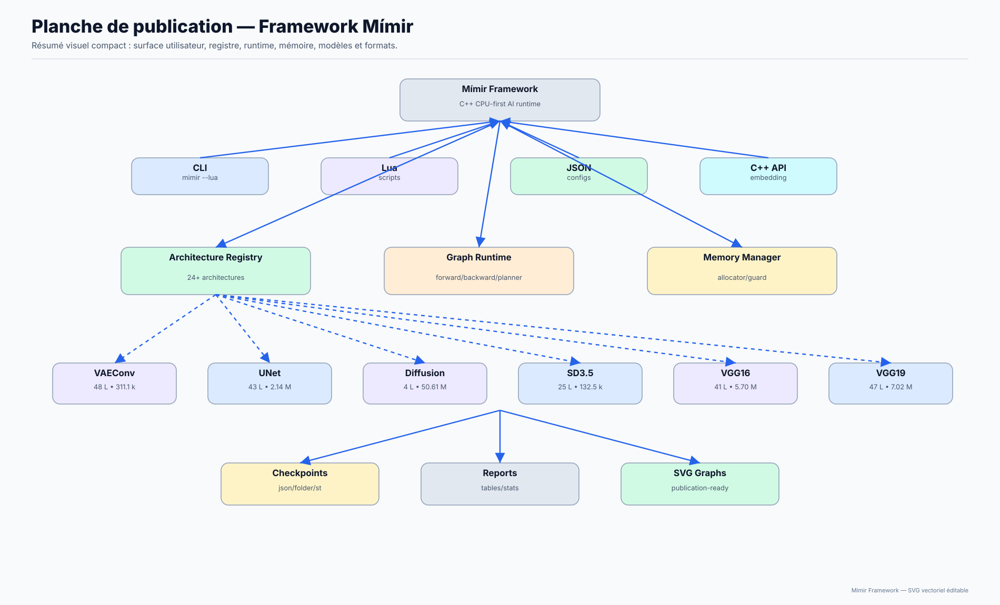

# Contribuer

Contribuer avec des changements cohérents et maintenables.

**Public concerné :** Contributeur du projet.

> **Prérequis**
>
> Connaître le workflow Git et les bases du projet.

## Diagramme d'explication

Compléments développeurs :

- Nouveau point d'entrée dev (canonique) : [docs/07-Devs/00-INDEX.md](../07-Devs/00-INDEX.md)
- Ajouter une architecture + registry + script Lua + outils : [docs/06-Contributing/02-New-Architecture-And-Tools.md](02-New-Architecture-And-Tools.md)
- Chapitre complet (models, runtimes, features, scripting multi-langage) : [docs/06-Contributing/03-Extending-Models-Runtimes-And-Features.md](03-Extending-Models-Runtimes-And-Features.md)
- Tutoriel pas-à-pas (ajouter une entrée Python, transposable Ruby/JS/Perl/Java/Rust) : [docs/06-Contributing/04-Tutorial-Add-Python-Scripting-Entry.md](04-Tutorial-Add-Python-Scripting-Entry.md)
- Audit, nettoyage et pull request publique : [Préparer une publication GitHub](05-Publishing-GitHub.md)
- Maturité vérifiée des composants : [État réel du projet](../00-PROJECT-STATUS.md)

## Philosophie

- Changements petits, testables.
- Préférer corriger la cause racine.

## Conventions

- Ajouter une doc courte quand on ajoute une feature.
- Mettre un script smoke test si possible.

## Où modifier

- Nouveau layer : `src/Layers.hpp` + exécution/backward dans `src/Model.cpp`
- Nouvelle architecture : `src/Models/Registry/ModelArchitectures.cpp`
- API scripting (contrat système commun) : `src/scriptings/ScriptingContext.hpp`
- API Lua (implémentation) : `src/scriptings/Lua/luaScripting/LuaScripting.cpp`

## Étapes suivantes

- [Revenir à la documentation](../00-INDEX.md)
- [Index de la documentation](../00-INDEX.md)
- [Page suivante : Développeurs : Ajouter une Architecture et Utiliser les Outils](02-New-Architecture-And-Tools.md)
