```mermaid
flowchart LR
  L1["1: vae_conv/raw_in | Identity"]
  L2["2: vae_conv/in_reshape | Reshape"]
  L3["3: vae_conv/in_to_chw | Permute"]
  L4["4: vae_conv/enc/conv_in | Conv2d"]
  L5["5: vae_conv/enc/conv_in/act | SiLU"]
  L6["6: vae_conv/enc/down1/conv | Conv2d"]
  L7["7: vae_conv/enc/down1/conv/act | SiLU"]
  L8["8: vae_conv/enc/down2/conv | Conv2d"]
  L9["9: vae_conv/enc/down2/conv/act | SiLU"]
  L10["10: vae_conv/enc/down3/conv | Conv2d"]
  L11["11: vae_conv/enc/down3/conv/act | SiLU"]
  L12["12: vae_conv/enc/down3/res/conv1 | Conv2d"]
  L13["13: vae_conv/enc/down3/res/act1 | SiLU"]
  L14["14: vae_conv/enc/down3/res/conv2 | Conv2d"]
  L15["15: vae_conv/enc/down3/res/add | Add"]
  L16["16: vae_conv/enc/proj | Conv2d"]
  L17["17: vae_conv/enc/proj/act | SiLU"]
  L18["18: vae_conv/enc/bot_res/conv1 | Conv2d"]
  L19["19: vae_conv/enc/bot_res/act1 | SiLU"]
  L20["20: vae_conv/enc/bot_res/conv2 | Conv2d"]
  L21["21: vae_conv/enc/bot_res/add | Add"]
  L22["22: vae_conv/enc/mu | Conv2d"]
  L23["23: vae_conv/enc/logvar | Conv2d"]
  L24["24: vae_conv/reparam | Reparameterize"]
  L25["25: vae_conv/z_prior_bias | Constant"]
  L26["26: vae_conv/z_prior_add | Add"]
  L27["27: vae_conv/dec/conv_in | Conv2d"]
  L28["28: vae_conv/dec/conv_in/act | SiLU"]
  L29["29: vae_conv/dec/bot_res/conv1 | Conv2d"]
  L30["30: vae_conv/dec/bot_res/act1 | SiLU"]
  L31["31: vae_conv/dec/bot_res/conv2 | Conv2d"]
  L32["32: vae_conv/dec/bot_res/add | Add"]
  L33["33: vae_conv/dec/up3/up | ConvTranspose2d"]
  L34["34: vae_conv/dec/up3/up/act | SiLU"]
  L35["35: vae_conv/dec/up3/skip_cat | Concat"]
  L36["36: vae_conv/dec/up3/skip_proj | Conv2d"]
  L37["37: vae_conv/dec/up2/up | ConvTranspose2d"]
  L38["38: vae_conv/dec/up2/up/act | SiLU"]
  L39["39: vae_conv/dec/up2/skip_cat | Concat"]
  L40["40: vae_conv/dec/up2/skip_proj | Conv2d"]
  L41["41: vae_conv/dec/up1/up | ConvTranspose2d"]
  L42["42: vae_conv/dec/up1/up/act | SiLU"]
  L43["43: vae_conv/dec/up1/skip_cat | Concat"]
  L44["44: vae_conv/dec/up1/skip_proj | Conv2d"]
  L45["45: vae_conv/dec/out | Conv2d"]
  L46["46: vae_conv/dec/tanh | Tanh"]
  L47["47: vae_conv/recon_to_hwc | Permute"]
  L48["48: vae_conv/out_concat | Concat"]
  S_t24(("t24"))
  S__input_(("__input__"))
  S__input_ -->|__input__| L1
  L1 -->|vae_conv/in_vec| L2
  L2 -->|vae_conv/in_hwc| L3
  L3 -->|vae_conv/in_chw| L4
  L4 -->|vae_conv/enc/c0| L5
  L5 -->|vae_conv/enc/c0_act| L6
  L6 -->|vae_conv/enc/down1/y| L7
  L7 -->|vae_conv/enc/down1/y_act| L8
  L8 -->|vae_conv/enc/down2/y| L9
  L9 -->|vae_conv/enc/down2/y_act| L10
  L10 -->|vae_conv/enc/down3/y| L11
  L11 -->|vae_conv/enc/down3/y_act| L12
  L12 -->|vae_conv/enc/down3/res/c1| L13
  L13 -->|vae_conv/enc/down3/res/c1a| L14
  L14 -->|vae_conv/enc/down3/res/c2| L15
  L11 -->|vae_conv/enc/down3/y_act| L15
  L15 -->|vae_conv/enc/down3/res/out| L16
  L16 -->|vae_conv/enc/h| L17
  L17 -->|vae_conv/enc/h_act| L18
  L18 -->|vae_conv/enc/bot_res/c1| L19
  L19 -->|vae_conv/enc/bot_res/c1a| L20
  L20 -->|vae_conv/enc/bot_res/c2| L21
  L17 -->|vae_conv/enc/h_act| L21
  L21 -->|vae_conv/enc/bot_res/out| L22
  L21 -->|vae_conv/enc/bot_res/out| L23
  L22 -->|vae_conv/mu| L24
  L23 -->|vae_conv/logvar| L24
  S_t24 -->|t24| L25
  L24 -->|vae_conv/z| L26
  L25 -->|vae_conv/prior_bias_out| L26
  L26 -->|vae_conv/z_biased| L27
  L27 -->|vae_conv/dec/c0| L28
  L28 -->|vae_conv/dec/c0_act| L29
  L29 -->|vae_conv/dec/bot_res/c1| L30
  L30 -->|vae_conv/dec/bot_res/c1a| L31
  L31 -->|vae_conv/dec/bot_res/c2| L32
  L28 -->|vae_conv/dec/c0_act| L32
  L32 -->|vae_conv/dec/bot_res/out| L33
  L33 -->|vae_conv/dec/up3/up_y| L34
  L34 -->|vae_conv/dec/up3/up_y_act| L35
  L9 -->|vae_conv/enc/down2/y_act| L35
  L35 -->|vae_conv/dec/up3/sc| L36
  L36 -->|vae_conv/dec/up3/sp| L37
  L37 -->|vae_conv/dec/up2/up_y| L38
  L38 -->|vae_conv/dec/up2/up_y_act| L39
  L7 -->|vae_conv/enc/down1/y_act| L39
  L39 -->|vae_conv/dec/up2/sc| L40
  L40 -->|vae_conv/dec/up2/sp| L41
  L41 -->|vae_conv/dec/up1/up_y| L42
  L42 -->|vae_conv/dec/up1/up_y_act| L43
  L5 -->|vae_conv/enc/c0_act| L43
  L43 -->|vae_conv/dec/up1/sc| L44
  L44 -->|vae_conv/dec/up1/sp| L45
  L45 -->|vae_conv/dec/out_pre| L46
  L46 -->|vae_conv/recon_chw| L47
  L47 -->|vae_conv/recon| L48
  L26 -->|vae_conv/z_biased| L48
  L23 -->|vae_conv/logvar| L48
```

# Exemple de sortie - analyze_model.lua

Commande :

```bash
lua scripts/tools/analyze_model.lua --in checkpoint/vae_conv-generique/epoch_0020-final --all true --graph-format mermaid
```

Sortie exemple :

```text
━━━━━━━━━━━━━━━━━━━━━━━━━━━━━━━━━━━━━━━━━━━━━━
  Analyse modèle
━━━━━━━━━━━━━━━━━━━━━━━━━━━━━━━━━━━━━━━━━━━━━━

+----------------+------------------------------------------------------------------------------------------------------+
| Clé            | Valeur                                                                                               |
+================+======================================================================================================+
| Chemin         | checkpoint/vae_conv-generique/epoch_0020-final                                                       |
| Format         | raw_folder                                                                                           |
| Modèle         | VAEConvModel                                                                                         |
| Type modèle    |                                                                                                      |
| Créé le        | 2026-06-28 23:54:47                                                                                  |
| Mímir version  | 3.0.1                                                                                                |
| Format version | 1.0.0                                                                                                |
| Git commit     | b08571f                                                                                              |
| Nb couches     | 48                                                                                                   |
| Params (arch)  | 311_136                                                                                              |
| Nb tensors     | 25                                                                                                   |
| Taille tensors | 26.9 MB                                                                                              |
| Composants     | tokenizer=true encoder=true optimizer=true                                                           |
| DType          | F32                                                                                                  |
| model_config   | image_w=512.0  image_h=512.0  image_c=3.0  latent_h=64.0  latent_w=64.0  latent_c=64.0  base_channel |
|                | s=16.0  use_attention=true  use_attn=true  enc_norm=none  enc_gn_groups=16.0  attn_heads=4.0  resnet |
|                | _max_tokens=4096.0  attn_max_tokens=4096.0  stochastic_latent=true  text_cond=false  d_model=128.0   |
|                | latent_dim=262144.0                                                                                  |
+----------------+------------------------------------------------------------------------------------------------------+

Graphe (Mermaid/Markdown)
```



```text
Couches
+----+------------------------------+-----------------+---------+---------+---------------------+
| #  | Layer                        | Type            | Params  | Weights | Dims                |
+====+==============================+=================+=========+=========+=====================+
|  1 | vae_conv/raw_in              | Identity        |       0 |       0 |                     |
|  2 | vae_conv/in_reshape          | Reshape         |       0 |       0 |                     |
|  3 | vae_conv/in_to_chw           | Permute         |       0 |       0 |                     |
|  4 | vae_conv/enc/conv_in         | Conv2d          |     432 |     432 | 3→16 (k=3 s=1 p=1)  |
|  5 | vae_conv/enc/conv_in/act     | SiLU            |       0 |       0 |                     |
|  6 | vae_conv/enc/down1/conv      | Conv2d          |   2_304 |   2_304 | 16→16 (k=3 s=2 p=1) |
|  7 | vae_conv/enc/down1/conv/act  | SiLU            |       0 |       0 |                     |
|  8 | vae_conv/enc/down2/conv      | Conv2d          |   2_304 |   2_304 | 16→16 (k=3 s=2 p=1) |
|  9 | vae_conv/enc/down2/conv/act  | SiLU            |       0 |       0 |                     |
| 10 | vae_conv/enc/down3/conv      | Conv2d          |   2_304 |   2_304 | 16→16 (k=3 s=2 p=1) |
| 11 | vae_conv/enc/down3/conv/act  | SiLU            |       0 |       0 |                     |
| 12 | vae_conv/enc/down3/res/conv1 | Conv2d          |   2_304 |   2_304 | 16→16 (k=3 s=1 p=1) |
| 13 | vae_conv/enc/down3/res/act1  | SiLU            |       0 |       0 |                     |
| 14 | vae_conv/enc/down3/res/conv2 | Conv2d          |   2_304 |   2_304 | 16→16 (k=3 s=1 p=1) |
| 15 | vae_conv/enc/down3/res/add   | Add             |       0 |       0 |                     |
| 16 | vae_conv/enc/proj            | Conv2d          |   2_304 |   2_304 | 16→16 (k=3 s=1 p=1) |
| 17 | vae_conv/enc/proj/act        | SiLU            |       0 |       0 |                     |
| 18 | vae_conv/enc/bot_res/conv1   | Conv2d          |   2_304 |   2_304 | 16→16 (k=3 s=1 p=1) |
| 19 | vae_conv/enc/bot_res/act1    | SiLU            |       0 |       0 |                     |
| 20 | vae_conv/enc/bot_res/conv2   | Conv2d          |   2_304 |   2_304 | 16→16 (k=3 s=1 p=1) |
| 21 | vae_conv/enc/bot_res/add     | Add             |       0 |       0 |                     |
| 22 | vae_conv/enc/mu              | Conv2d          |   1_024 |   1_024 | 16→64 (k=1 s=1)     |
| 23 | vae_conv/enc/logvar          | Conv2d          |   1_024 |   1_024 | 16→64 (k=1 s=1)     |
| 24 | vae_conv/reparam             | Reparameterize  |       0 |       0 |                     |
| 25 | vae_conv/z_prior_bias        | Constant        | 262_144 | 262_144 | 64→64 (s=1)         |
| 26 | vae_conv/z_prior_add         | Add             |       0 |       0 |                     |
| 27 | vae_conv/dec/conv_in         | Conv2d          |   9_216 |   9_216 | 64→16 (k=3 s=1 p=1) |
| 28 | vae_conv/dec/conv_in/act     | SiLU            |       0 |       0 |                     |
| 29 | vae_conv/dec/bot_res/conv1   | Conv2d          |   2_304 |   2_304 | 16→16 (k=3 s=1 p=1) |
| 30 | vae_conv/dec/bot_res/act1    | SiLU            |       0 |       0 |                     |
| 31 | vae_conv/dec/bot_res/conv2   | Conv2d          |   2_304 |   2_304 | 16→16 (k=3 s=1 p=1) |
| 32 | vae_conv/dec/bot_res/add     | Add             |       0 |       0 |                     |
| 33 | vae_conv/dec/up3/up          | ConvTranspose2d |   4_096 |   4_096 | 16→16 (k=4 s=2 p=1) |
| 34 | vae_conv/dec/up3/up/act      | SiLU            |       0 |       0 |                     |
| 35 | vae_conv/dec/up3/skip_cat    | Concat          |       0 |       0 |                     |
| 36 | vae_conv/dec/up3/skip_proj   | Conv2d          |     512 |     512 | 32→16 (k=1 s=1)     |
| 37 | vae_conv/dec/up2/up          | ConvTranspose2d |   4_096 |   4_096 | 16→16 (k=4 s=2 p=1) |
| 38 | vae_conv/dec/up2/up/act      | SiLU            |       0 |       0 |                     |
| 39 | vae_conv/dec/up2/skip_cat    | Concat          |       0 |       0 |                     |
| 40 | vae_conv/dec/up2/skip_proj   | Conv2d          |     512 |     512 | 32→16 (k=1 s=1)     |
| 41 | vae_conv/dec/up1/up          | ConvTranspose2d |   4_096 |   4_096 | 16→16 (k=4 s=2 p=1) |
| 42 | vae_conv/dec/up1/up/act      | SiLU            |       0 |       0 |                     |
| 43 | vae_conv/dec/up1/skip_cat    | Concat          |       0 |       0 |                     |
| 44 | vae_conv/dec/up1/skip_proj   | Conv2d          |     512 |     512 | 32→16 (k=1 s=1)     |
| 45 | vae_conv/dec/out             | Conv2d          |     432 |     432 | 16→3 (k=3 s=1 p=1)  |
| 46 | vae_conv/dec/tanh            | Tanh            |       0 |       0 |                     |
| 47 | vae_conv/recon_to_hwc        | Permute         |       0 |       0 |                     |
| 48 | vae_conv/out_concat          | Concat          |       0 |       0 |                     |
+----+------------------------------+-----------------+---------+---------+---------------------+

Top tensors (par taille)
+----+--------------------------------------+-------+-------------+-----------+---------+
| #  | Tensor                               | DType | Shape       | Elems     | Taille  |
+====+======================================+=======+=============+===========+=========+
|  1 | encoder_token_embeddings             | F32   | [47895x128] | 6_130_560 | 23.4 MB |
|  2 | optimizer/m                          | F32   | [311136]    |   311_136 | 1.19 MB |
|  3 | optimizer/v                          | F32   | [311136]    |   311_136 | 1.19 MB |
|  4 | vae_conv/z_prior_bias_weights        | F32   | [262144]    |   262_144 |    1 MB |
|  5 | vae_conv/dec/conv_in_weights         | F32   | [9216]      |     9_216 |   36 KB |
|  6 | vae_conv/dec/up3/up_weights          | F32   | [4096]      |     4_096 |   16 KB |
|  7 | vae_conv/dec/up1/up_weights          | F32   | [4096]      |     4_096 |   16 KB |
|  8 | vae_conv/dec/up2/up_weights          | F32   | [4096]      |     4_096 |   16 KB |
|  9 | vae_conv/enc/down3/conv_weights      | F32   | [2304]      |     2_304 |    9 KB |
| 10 | vae_conv/enc/bot_res/conv1_weights   | F32   | [2304]      |     2_304 |    9 KB |
| 11 | vae_conv/enc/proj_weights            | F32   | [2304]      |     2_304 |    9 KB |
| 12 | vae_conv/enc/bot_res/conv2_weights   | F32   | [2304]      |     2_304 |    9 KB |
| 13 | vae_conv/dec/bot_res/conv2_weights   | F32   | [2304]      |     2_304 |    9 KB |
| 14 | vae_conv/enc/down2/conv_weights      | F32   | [2304]      |     2_304 |    9 KB |
| 15 | vae_conv/dec/bot_res/conv1_weights   | F32   | [2304]      |     2_304 |    9 KB |
| 16 | vae_conv/enc/down3/res/conv1_weights | F32   | [2304]      |     2_304 |    9 KB |
| 17 | vae_conv/enc/down3/res/conv2_weights | F32   | [2304]      |     2_304 |    9 KB |
| 18 | vae_conv/enc/down1/conv_weights      | F32   | [2304]      |     2_304 |    9 KB |
| 19 | vae_conv/enc/logvar_weights          | F32   | [1024]      |     1_024 |    4 KB |
| 20 | vae_conv/enc/mu_weights              | F32   | [1024]      |     1_024 |    4 KB |
+----+--------------------------------------+-------+-------------+-----------+---------+

✓ Analyse terminée
```
