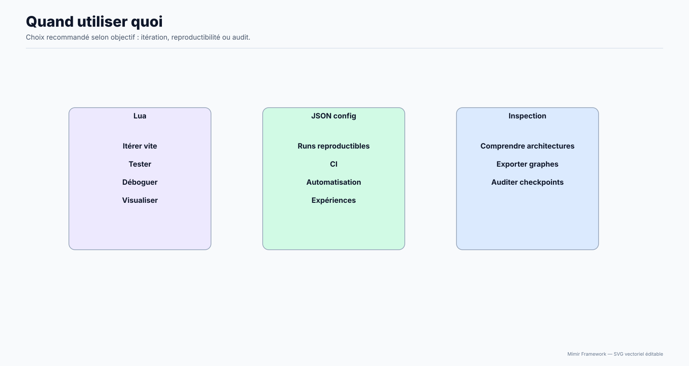

# Scripts Mímir v3.1.0

Organisation des scripts Lua pour le framework Mímir.

Cette page décrit les scripts utiles dans le workspace actuel. Elle ne reflète pas l’ancienne arborescence documentaire archivée.

## Structure

```text
scripts/
├── demos/           # (réservé) Démonstrations (actuellement vide)
├── examples/        # (réservé) Exemples (actuellement vide)
├── tests/           # Tests et validation
├── benchmarks/      # Benchmarks
├── training/        # Scripts d'entraînement
├── templates/       # Templates pour nouveaux modèles
├── modules/         # Modules partagés (args, ws server, tokenizer, etc.)
└── tools/           # Outils divers (inspection d'archis, analyse de modèles)
```

## Catégories

### 📊 Démonstrations (`demos/`)

(Dossier réservé — vide dans ce workspace.)

### 💡 Exemples (`examples/`)

(Dossier réservé — vide dans ce workspace.)

### 🧪 Tests (`tests/`)

Scripts de validation et tests:

- `test_vae_conv_generate.lua` - Génération VAE Conv (smoke)
- `test_serialization_smoke.lua` - Smoke test sérialisation (SafeTensors)

Usage recommandé : commence par `test_serialization_smoke.lua` si tu veux un signal rapide que le binaire, l’API Lua et la sérialisation sont tous opérationnels.

### 🛠️ Outils (`tools/`)

Outils d'inspection et d'analyse:

- `inspect_architectures.lua` - Liste les architectures + dtypes, inspecte une archi et peut l'exporter (`-a`, `-l <arch> -p`, `-d`, `-e <path>`)
- `analyze_model.lua` - Analyse un checkpoint/modèle (SafeTensors / RawFolder / DebugJson) avec graphes `table|blocks|mermaid|mlp_graph` et export image (`--graph-out`)
- `build_tags_vocab.lua` - Construit un vocab de tags depuis un dataset (`.txt` séparés par des points)
- `convert_checkpoint2safetensor.lua` - Convertit un checkpoint RawFolder → SafeTensors
- `convert_safetensors2raw_folder.lua` - Convertit un checkpoint SafeTensors → RawFolder

Schémas utiles (SVG):




### ⚡ Benchmarks (`benchmarks/`)

Scripts de performance:

- `benchmark_official.lua` - Benchmark standard
- `benchmark_stress.lua` - Test de stress
- `benchmark.lua` / `benchmark_complet.lua` / `benchmark_conv_train.lua` - Benchmarks complémentaires

### 🎓 Training (`training/`)

Scripts d'entraînement:

- `ponyxl_ddpm_train.lua` - Entraînement PonyXL-DDPM (diffusion)
- `ponyxl_ddpm_direct_train.lua` - Entraînement PonyXL-DDPM direct sur une image + un prompt, sans loader de dataset
- `train_vae_conv.lua` - Entraînement VAE Conv
- `train_vae_texte.lua` - Entraînement VAE Texte

### 📝 Templates (`templates/`)

Templates pour développement:

- `template_new_model.lua` - Lifecycle complet bas niveau (API Mimir directe)
- `template_pipeline_only.lua` - Pipeline minimal (via variables d'environnement)
- `template_pipeline_args.lua` - Pipeline + args CLI + mode registry-first

Choix rapide :

- `template_new_model.lua` si tu dois comprendre le cycle create/allocate/init/train/save détaillé.
- `template_pipeline_only.lua` si tu veux un exemple simple pilotable par env (pas d'args.lua).
- `template_pipeline_args.lua` si tu veux un template production-ready avec :
  - parsing d'arguments via `--flag value` et `--override key=val`,
  - mode **registry-first** : `--from-registry --arch my_arch` charge la config du registre,
  - puis fusionne tes overrides locaux avec `--d-model 256 --layers 4`, etc.

## Utilisation

### Aide CLI des scripts Lua

Tous les scripts Lua executables du repo (dossiers `scripts/` et `examples/`) acceptent maintenant:

```bash
./bin/mimir --lua <script.lua> -- --help
```

Le flag `--help` affiche:

- une description du script,
- les options/flags detectes dans le script,
- les flags communs (ex: `--help`, et selon le script des flags `args.lua` comme `--viz`, `--htop`, `--override`).

Note: conserver le separateur `--` avant les arguments du script Lua.

### Exécution depuis la racine du projet

```bash
# Templates
./bin/mimir --lua scripts/templates/template_new_model.lua
./bin/mimir --lua scripts/templates/template_pipeline_only.lua
./bin/mimir --lua scripts/templates/template_pipeline_args.lua -- --no-train

# Mode registry-first (pipeline_args)
./bin/mimir --lua scripts/templates/template_pipeline_args.lua -- \
  --from-registry --arch transformer \
  --d-model 256 --layers 4 --heads 8 --seq-len 128 \
  --dataset dataset.bin --epochs 1 --lr 0.0003 --save run.safetensors

# Tests
./bin/mimir --lua scripts/tests/test_serialization_smoke.lua

# Outils
./bin/mimir --lua scripts/tools/inspect_architectures.lua -- -a
./bin/mimir --lua scripts/tools/inspect_architectures.lua -- -l vae_conv -e /tmp/vae_conv_export.json
./bin/mimir --lua scripts/tools/inspect_architectures.lua -- -l vae_conv -e /tmp/vae_conv_export/
./bin/mimir --lua scripts/tools/inspect_architectures.lua -- -l vae_conv -e /tmp/vae_conv_export.safetensors
./bin/mimir --lua scripts/tools/analyze_model.lua -- --in checkpoint/vae_conv-generique/epoch_0018 --graph-format mlp_graph
./bin/mimir --lua scripts/tools/analyze_model.lua -- --in checkpoint/vae_conv-generique/epoch_0018 --graph-format mlp_graph --graph-out /tmp/arch.svg

# Benchmark
./bin/mimir --lua scripts/benchmarks/benchmark_official.lua -- --safe --iters 1

# Training
./bin/mimir --lua scripts/training/ponyxl_ddpm_train.lua -- --help
./bin/mimir --lua scripts/training/ponyxl_ddpm_direct_train.lua -- --help
```

Règles d'export pour `inspect_architectures.lua -e`:

- `*.json` -> export `debugJSON`
- chemin finissant par `/` -> export `rawFolder`
- `*.safetensors` (ou `*.st`) -> export `safetensors`

Lecture pratique de ces commandes :

- templates : découverte et prototypage,
- tests : validation ciblée d’un sous-système,
- benchmarks : mesure rapide et régression perf,
- training : scripts complets avec plus de paramètres et d’état.

### Avec run_mimir.sh

```bash
./run_mimir.sh --lua scripts/templates/template_new_model.lua
```

### Bootstrap environnement (config.sh)

`config.sh` est un script utilitaire a la racine du repo (pas dans `scripts/`) pour Linux Debian/Ubuntu.

```bash
./config.sh
cmake --build build -j"$(nproc)"
```

Variables frequentes : `BUILD_TYPE=Debug`, `ENABLE_VULKAN=0`, `ENABLE_OPENCL=0`, `ENABLE_SFML=0`, `ENABLE_LZ4=0`.

## Statistiques

- **NB** : ce README reflète l'état du dossier `scripts/` à la date de la release.

En cas de doute sur un script, la référence principale reste le code Lua lui-même. Plusieurs fichiers sont pensés comme exemples exécutables avant d’être des tutoriels exhaustifs.

## Pipeline API (modules/pipeline.lua)

Module Lua pour piloter les modèles via le registre d'architectures du framework.

### Utilisation rapide

```lua
local P = dofile("scripts/modules/pipeline.lua")
local pipe = P.FromRegistry("transformer")  -- ou P.Transformer(cfg) pour la forme spécialisée
pipe:loadDefaultConfig("transformer")
pipe:patchConfig({ d_model = 256, num_layers = 4 })
pipe:build()
pipe:train("dataset.bin", 10, 0.0003)
pipe:save("model.safetensors")
```

### Constructeurs disponibles

- `P.FromRegistry(arch, config, options)` - générique, charge du registre
- `P.Transformer(config)` - constructeur spécialisé
- `P.UNet(config)`, `P.VAE(config)`, `P.ViT(config)`, `P.Diffusion(config)`, etc.

### Méthodes du pipeline

- `pipe:loadDefaultConfig(arch, patch?)` - charge la config du registre
- `pipe:patchConfig(patch)` - fusionne des overrides
- `pipe:getConfig()`, `pipe:getBaseConfig()` - lecture
- `pipe:build()` - create → dtype → build → allocate → init
- `pipe:train(dataset, epochs, lr)` - entraînement
- `pipe:infer(input)` - inférence
- `pipe:save(path)` - sauvegarde (format déduit depuis l'extension)

## Voir aussi

- [Documentation complète](../docs/00-INDEX.md)
- [Guide de démarrage rapide](../docs/01-Getting-Started/01-Quick-Start.md)
- [Vue d'ensemble API Lua](../docs/03-API-Reference/00-API-Overview.md)
- [Workflow modèle](../docs/02-User-Guide/02-Model-Lifecycle.md)
- [Développeurs: nouvelles architectures et outils](../docs/06-Contributing/02-New-Architecture-And-Tools.md)

---

**Version**: 3.1.0 | **Date**: 1 juillet 2026
